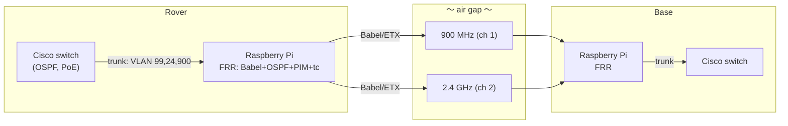
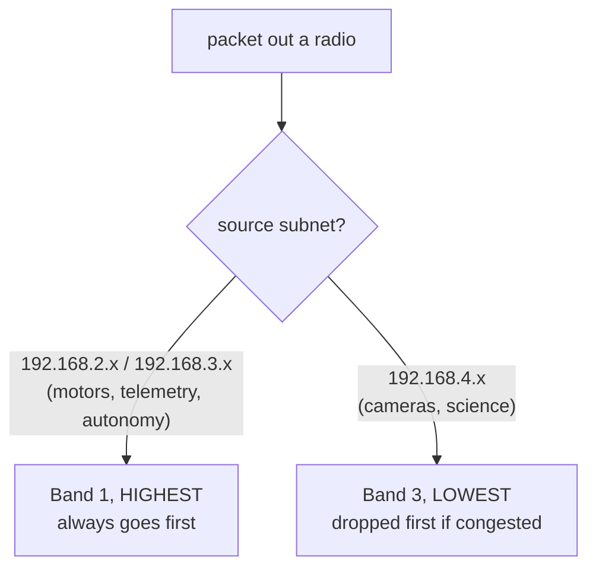

# Babel, the proposed routing upgrade

:::note[Status: about 90% done, one blocker]
Babel is almost completely implemented and has been bench-tested working. The one unsolved problem is route flapping, which is covered in [How real is it?](#how-real-is-it) below. Once that's solved it's competition-ready. It all lives in `NetworkAndSignalsInfo/MRDT_Babel_Router/`, and it's the network project worth pushing hardest next year.
:::

## The problem it solves

The EIGRP setup we run [today](./network#routing-eigrp-as-90-today) is great on a stable wired network, but it's basically blind on a lossy wireless one. It only sees a link as up or down, and it has no way to tell that a link is up but dropping 40% of its packets, so when the rover drives behind a hill, EIGRP just keeps shoving data into a dying link and the whole network stalls.

Babel (RFC 8966) fixes that by measuring ETX, the Expected Transmission Count, which is really a measure of actual packet loss. When a link starts degrading, Babel raises its cost and shifts the traffic over to a cleaner frequency in milliseconds, which is exactly the failure we keep hitting where the rover freezes in the middle of a mission.

## The architecture: "Router on a Stick"

We keep the Cisco switches around for PoE and fast local switching, and we add a Raspberry Pi edge router on each side running FRRouting. Each Pi hangs off an 802.1Q trunk and handles the intelligent wireless routing and traffic shaping that the Cisco switches can't do.



Locally, the Cisco switches run OSPF and dump the transit traffic onto VLAN 99. Across the air, the Pis run Babel on the radio subinterfaces (`eth0.900`, `eth0.24`, and you'd add the 5.8 GHz one), redistributing in and out of OSPF. For the camera multicast, the Pis also run PIM so the `239.x` streams survive the gap, since Babel and OSPF only handle unicast.

## QoS, guaranteeing the joystick

The Pi uses Linux `tc` with a `prio` qdisc and three bands, so the control traffic never starves behind the video.



So even when we get forced down onto the slow 900 MHz backup, the rover still drives, because the video gets throttled before the joystick does.

## How to deploy it

The repo has a generator that produces the exact configs for your VLANs and hardware.

```bash
python3 generate_configs.py    # → generated_configs/: cisco .txt, FRR .conf, netplan.yaml, qos.sh
```

From there it's a handful of steps:

1. Paste `*_switch.txt` into each Cisco switch.
2. Apply `*_netplan.yaml` on each Pi.
3. Install FRR on each Pi with `apt install frr frr-pythontools python3-flask`.
4. Enable the daemons in `/etc/frr/daemons`: `zebra`, `ospfd`, `babeld`, and `pimd`.
5. Load the routing by pasting `*_frr.conf` through `vtysh`.
6. Apply QoS by running the generated QoS scripts. There are ready-made `services/*.service` units for this.

Once it's up, run the Flask dashboard (`dashboard.py`, port `5000`) on a Pi so you can watch the live ETX, latency, and link selection while you test.

:::warning[Before competition]
The committed `generated_configs/` only wired up two radios, 900 and 2.4, which matches the fact that [5.8 GHz is currently shut down](./network#the-wireless-gap-the-rockets). Regenerate with all three bands and validate both PIM multicast for the camera feeds and QoS for the joystick on 900 MHz, end to end, before you trust it at competition.
:::

## How real is it?

There's a lot more here than a design on paper, so go look in the repo. Babel is nearly fully implemented and it has been tested working, and there's exactly one blocker left, which is route flapping where the routes oscillate. Clayton Cowen was working on this and graduated before solving it, and there are no debugging notes left behind, so whoever picks it up is effectively starting fresh on that specific bug. Once the flapping is solved we get a real upgrade, because Babel can push traffic down both paths at once and, unlike EIGRP, it actually gives us insight into what the network is doing.

### Why we really want it: the switches are a black box

Right now our Cisco switches are completely opaque. There's no realistic way to see what EIGRP is doing in the middle of a competition run short of SSHing into a switch and running CLI commands, which isn't happening while you're driving a mission. So there's a web dashboard (`dashboard.py`, port `5000`) that pulls live data from FRR with `vtysh show babel neighbor/route json` and shows, for each link, the ETX route cost and the latency, the throughput broken down by traffic category and VLAN, and the neighbor link quality along with which link is currently active. Being able to actually see where your traffic is going during a run is a big reason to make the switch on its own.

### The tradeoff

Babel does add a failure point, because a Raspberry Pi sits inline on both the rover and base sides, and a Pi can die. With enough testing it can probably be made reliable, and the payoff is large, because it would let us replace the expensive Cisco switches with much lighter and cheaper managed switches once the intelligence moves onto the Pi.
