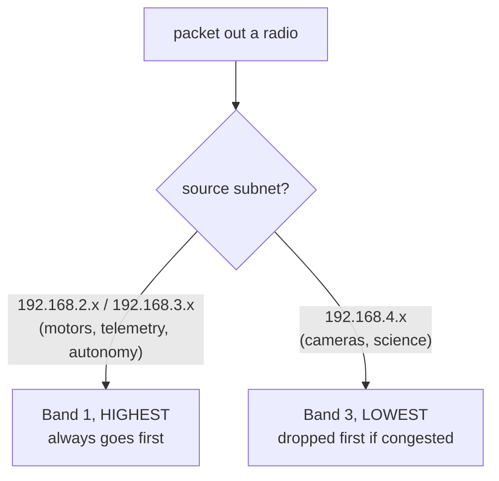
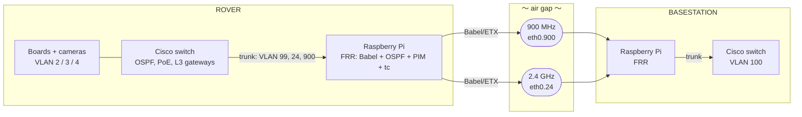
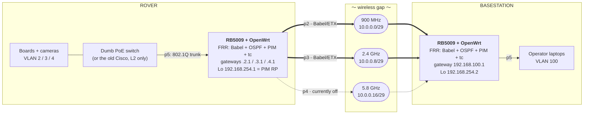
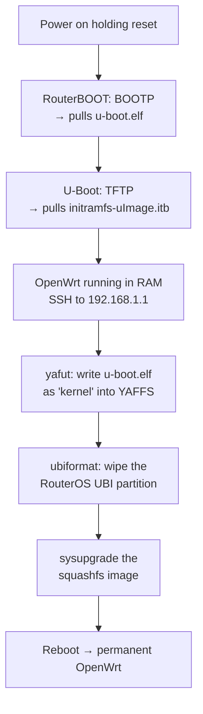

import LinkSim from '@site/src/components/visuals/LinkSim';

# Babel, the proposed routing upgrade

:::note[Status: about 90% done, one blocker, and a new hardware option]
Babel is almost completely implemented and has been bench-tested working on Raspberry Pis. The one unsolved problem is route flapping, which is covered in [How real is it?](#how-real-is-it) below. It all lives in [MRDT_Babel_Router](https://github.com/ClayJay3/MRDT_Babel_Router), and it's the network project worth pushing hardest next year.

There are now **two hardware paths** to ship it. The original one bolts a Raspberry Pi onto the existing Cisco switches ([Path A](#path-a-router-on-a-stick-raspberry-pi-edge-routers)). The newer one replaces the Pi *and* the Cisco's routing role with a single **MikroTik RB5009 running OpenWrt** ([Path B](#path-b-the-mikrotik-rb5009-running-openwrt)), and that's the one to go with. Neither one fixes the flapping bug on its own, so read that section before you spend money.
:::

## The problem it solves

The EIGRP setup we run [today](./network#routing-eigrp-as-90-today) is great on a stable wired network, but it's basically blind on a lossy wireless one. It only sees a link as up or down, and it has no way to tell that a link is up but dropping 40% of its packets, so when the rover drives behind a hill, EIGRP just keeps shoving data into a dying link and the whole network stalls.

Babel (RFC 8966) fixes that by measuring ETX, the Expected Transmission Count, which is really a measure of actual packet loss. When a link starts degrading, Babel raises its cost and shifts the traffic over to a cleaner frequency in milliseconds, which is exactly the failure we keep hitting where the rover freezes in the middle of a mission.

## The design, whichever box you run it on

Everything in this section is hardware-independent. Both paths run the same software stack, which is [FRRouting](https://frrouting.org/) on Linux, and the `frr.conf` is close to identical between them. Only the interface names and the box change.

### Babel across the radios, OSPF locally

Babel runs on the radio-facing interfaces, one per band, and measures ETX per link. Whatever handles the local wired side, whether that's the Cisco switch or the router itself, runs OSPF, and the two protocols redistribute into each other. Babel picks which radio your traffic crosses, and OSPF just gets it to the right VLAN on either end.

### QoS, guaranteeing the joystick

Linux `tc` with a `prio` qdisc and three bands, applied on the egress side of each radio interface, so the control traffic never starves behind the video.


```mermaid
flowchart TD
  P["packet out a radio"] --> Q{"source subnet?"}
  Q -->|"192.168.2.x / 192.168.3.x<br/>(motors, telemetry, autonomy)"| B1["Band 1, HIGHEST<br/>always goes first"]
  Q -->|"192.168.4.x<br/>(cameras, science)"| B3["Band 3, LOWEST<br/>dropped first if congested"]
```

So even when we get forced down onto the slow 900 MHz backup, the rover still drives, because the video gets throttled before the joystick does. This is why the [VLAN plan is function-based](./network#the-ip-plan-is-laid-out-on-purpose), since the subnet *is* the traffic class.

### PIM, so the cameras survive the gap

Babel and OSPF only carry unicast. The camera feeds are UDP multicast on `239.0.0.1` through `239.0.0.10`, so whatever box is doing the routing has to run PIM as well, with the rover-side loopback `192.168.254.1` as the Rendezvous Point. Forget this and every camera goes black the moment you move routing off the Cisco switches.

### The dashboard

This is a big part of why we want the change at all. Our Cisco switches are completely opaque, and there's no realistic way to see what EIGRP is doing mid-run short of SSHing into a switch and typing CLI commands, which is not happening while you're driving a mission.

So there's a Flask web dashboard (`dashboard.py`, port `5000`) that pulls live data out of FRR with `vtysh show babel neighbor/route json` and shows, per link, the ETX route cost and latency, the throughput broken down by traffic category and VLAN, and the neighbor link quality plus which link is currently active. Being able to actually see where your traffic is going during a run is a strong enough reason to switch on its own. It runs unchanged on both hardware paths.

### See the difference for yourself

Drag each band's packet loss and compare how the two routing schemes react. EIGRP only knows "up or down," so it keeps load-balancing onto a half-dead link. Babel measures ETX and moves the joystick traffic to the cleanest band before the video.

<LinkSim />

## Two hardware paths

| | Path A: Raspberry Pi | Path B: MikroTik RB5009 |
|---|---|---|
| Boxes inline per side | 2 (Cisco + Pi) | 1 |
| Cost per side | Pi 4 + PoE HAT + SD, plus the Cisco we already own | **$219** for the RB5009UG+S+IN |
| Availability | Pis are fine, but a Cisco IE3300 with `network-advantage` is a four-figure part with a lead time | In stock at a dozen distributors, next-day |
| Ports for radios | One trunk port, VLAN-tagged subinterfaces | 8 physical ports, one per radio, no trunk needed |
| Boot media | microSD card | 1 GB NAND, squashfs + overlay |
| Temp range | Pi throttles, no rating | **-40 °C to +60 °C**, passive, no fan |
| Power in | 5 V USB-C / PoE HAT | 24 to 57 V (DC jack, 2-pin terminal, or PoE-in) |
| Firmware risk | none | none, it's OpenWrt, no license tier to lose |
| Prototype status | **built and bench-tested** | designed here, not yet built |

Path A is the one that has actually run, and all the existing work in the repo targets it. Path B is better hardware and is where this should end up, but somebody has to do the port. The FRR config is the hard part and it carries over almost verbatim, so the port is small.

:::tip[The real argument for Path B]
It isn't only about price. The Cisco switches are a [licensing trap](./network), where one firmware update loses you Layer-3 routing until someone re-licenses them, and there's no spare on the shelf. An RB5009 is $219, replaceable in a day, and you can flash it as many times as you want. The point is moving the intelligence onto a box we fully control.
:::

## Path A, router on a stick (Raspberry Pi edge routers)

This is the architecture the existing prototype implements. Keep the Cisco switches for PoE and fast local switching, and add a Raspberry Pi edge router on each side running FRR. Each Pi hangs off an 802.1Q trunk and handles the intelligent wireless routing and traffic shaping the Cisco can't do.


```mermaid
flowchart LR
  subgraph R["ROVER"]
    direction TB
    RB["Boards + cameras<br/>VLAN 2 / 3 / 4"]
    RC["Cisco switch<br/>OSPF, PoE, L3 gateways"]
    RP["Raspberry Pi<br/>FRR: Babel + OSPF + PIM + tc"]
    RB --- RC
    RC -->|"trunk: VLAN 99, 24, 900"| RP
  end

  subgraph AIR["～ air gap ～"]
    direction TB
    L900(["900 MHz<br/>eth0.900"])
    L24(["2.4 GHz<br/>eth0.24"])
  end

  subgraph B["BASESTATION"]
    direction TB
    BP["Raspberry Pi<br/>FRR"]
    BC["Cisco switch<br/>VLAN 100"]
    BP -->|trunk| BC
  end

  RP -->|Babel/ETX| L900 --> BP
  RP -->|Babel/ETX| L24 --> BP
```

Locally, the Cisco switches keep running OSPF and dump the transit traffic onto VLAN 99. Across the air, the Pis run Babel on the radio subinterfaces (`eth0.900`, `eth0.24`, and you'd add the 5.8 GHz one), redistributing in and out of OSPF, plus PIM so the `239.x` camera streams survive the gap.

### How to deploy it

The repo has a generator that produces the exact configs for your VLANs and hardware.

```bash
python3 generate_configs.py    # → generated_configs/: cisco .txt, FRR .conf, netplan.yaml, qos.sh
```

From there it's a handful of steps:

1. Paste `*_switch.txt` into each Cisco switch.
2. Apply `*_netplan.yaml` on each Pi.
3. Install FRR on each Pi with `apt install frr frr-pythontools python3-flask`.
4. Enable the daemons in `/etc/frr/daemons`: `zebra`, `ospfd`, `babeld`, and `pimd`.
5. Load the routing by pasting `*_frr.conf` through `vtysh`.
6. Apply QoS by running the generated QoS scripts. There are ready-made `services/*.service` units for this.

Once it's up, run `dashboard.py` on a Pi so you can watch live ETX, latency, and link selection while you test.

### What's wrong with it

Two boxes inline on each side, and the Pi adds a failure point that isn't rated for anything. The microSD card is the single most common way a Pi dies, and it usually goes silently, mid-run, after a hard power cut. The Pi also has one usable Ethernet port, so every radio and every VLAN shares one trunk and one 1 Gb link, and it still leaves the Cisco licensing problem completely untouched.

:::warning[Before competition, if you ship Path A]
The committed `generated_configs/` only wired up two radios, 900 and 2.4, which matches the fact that [5.8 GHz is currently shut down](./network#the-wireless-gap-the-rockets). Regenerate with all three bands and validate both PIM multicast for the camera feeds and QoS for the joystick on 900 MHz, end to end, before you trust it at competition.
:::

## Path B, the MikroTik RB5009 running OpenWrt

One [MikroTik RB5009UG+S+IN](https://mikrotik.com/product/rb5009ug_s_in) per side, flashed with OpenWrt, running the same FRR stack. It absorbs both the Pi's job and the Cisco's Layer-3 job, so the Cisco (or any cheap managed PoE switch) gets demoted to dumb Layer-2 PoE.

### Why this box

- **It's a real router.** Quad-core Cortex-A72 at 1.4 GHz, 1 GB DDR4, 1 GB NAND, and a Marvell 88E6393X switch chip with a 10 Gbps link to the CPU. Routing a couple of 1 Gb links and shaping a few Mbps of radio traffic doesn't come close to loading it.
- **Eight ports.** 7× 1 GbE, 1× 2.5 GbE, 1× SFP+. Every radio gets its own dedicated routed port, so the whole 802.1Q trunk-to-the-router mess from Path A disappears.
- **It survives a rover.** -40 °C to +60 °C, passive cooling with no fan, in a metal case. 24 to 57 V input via DC jack, 2-pin terminal, or PoE-in. 14 W idle, 25 W loaded.
- **No SD card.** Boots off NAND with a read-only squashfs and an overlay. A hard power cut doesn't corrupt it the way it corrupts a Pi.
- **Nothing to license.** It's OpenWrt. Flash it a hundred times, there's no `network-advantage` tier to lose.

:::danger[Buy the UG, not the UPr]
The PoE-out variant, the **RB5009UPr+S+IN** ($299, PoE-out on all 8 ports), is *not* supported by mainline OpenWrt. Support lives in community developer branches, PoE-out needs an out-of-tree `mtpoe-ctrl` tool, and people report boot loops after flashing. Do not build the plan around it.

Buy the plain **RB5009UG+S+IN** ($219). It has PoE-*in* only and no PoE-*out*, which means **it cannot power anything.** Whatever the Cisco is currently feeding PoE, meaning cameras, boards, and the radios' injectors, still needs a PoE source. See [what this doesn't solve](#what-this-does-not-solve).
:::

### RouterOS can't do this, you have to flash OpenWrt

MikroTik's own RouterOS v7 does **not** implement Babel. It has BGP, OSPF, RIP, and IS-IS, and that's it. This box only works for us because it runs OpenWrt, which gives us a normal Linux kernel with FRR, `tc`, and PIM. Do not buy this expecting to configure it in Winbox.

### The architecture


```mermaid
flowchart LR
  subgraph ROVER["ROVER"]
    direction TB
    RBRD["Boards + cameras<br/>VLAN 2 / 3 / 4"]
    RSW["Dumb PoE switch<br/>(or the old Cisco, L2 only)"]
    RRT["<b>RB5009 + OpenWrt</b><br/>FRR: Babel + OSPF + PIM + tc<br/>gateways .2.1 / .3.1 / .4.1<br/>Lo 192.168.254.1 = PIM RP"]
    RBRD --- RSW
    RSW -->|"p5: 802.1Q trunk"| RRT
  end

  subgraph AIR["～ wireless gap ～"]
    direction TB
    L900(["900 MHz<br/>10.0.0.0/29"])
    L24(["2.4 GHz<br/>10.0.0.8/29"])
    L58(["5.8 GHz<br/>10.0.0.16/29"])
  end

  subgraph BASE["BASESTATION"]
    direction TB
    BRT["<b>RB5009 + OpenWrt</b><br/>FRR: Babel + OSPF + PIM + tc<br/>gateway 192.168.100.1<br/>Lo 192.168.254.2"]
    BH["Operator laptops<br/>VLAN 100"]
    BRT -->|"p5"| BH
  end

  RRT ==>|"p2 · Babel/ETX"| L900 ==> BRT
  RRT ==>|"p3 · Babel/ETX"| L24 ==> BRT
  RRT -.->|"p4 · currently off"| L58 -.-> BRT
```

Compare that to the Path A diagram. The trunk to the router is gone from the radio side entirely, and the Cisco is no longer doing any routing. Every radio is on its own physical port with its own `/29`, exactly the way the [wireless table](./network#the-wireless-gap-the-rockets) already describes it, so Babel sees three clean point-to-point links with nothing tagged or bridged in between.

### Port map

OpenWrt exposes the switch through DSA, so each port is a normal netdev with a fixed name. These names come straight from the device tree, so they're the same on every unit.

| OpenWrt name | Case label | Speed | Use it for |
|---|---|---|---|
| `p1` | 2.5G | 2.5 GbE, PoE-in | Management and flashing. This is the port RouterBOOT netboots from. |
| `p2` | 2 | 1 GbE | 900 MHz radio, `10.0.0.1/29` on the rover and `10.0.0.2/29` on the base |
| `p3` | 3 | 1 GbE | 2.4 GHz radio, `10.0.0.9/29` on the rover and `10.0.0.10/29` on the base |
| `p4` | 4 | 1 GbE | 5.8 GHz radio, `10.0.0.17/29` on the rover and `10.0.0.18/29` on the base |
| `p5` | 5 | 1 GbE | 802.1Q trunk down to the PoE switch (VLANs 2/3/4, or 100 on base) |
| `p6` to `p8` | 6 to 8 | 1 GbE | Spare. A fourth radio, a direct laptop drop, a second trunk. |
| `sfp` | SFP+ | 10G / 1G | Spare. Fiber or DAC if the base ever needs a long run. |

There's also a USB 3.0 port, which is worth using. Stick a flash drive in it and log ETX traces for a whole run without touching the overlay.

### Setup

#### 1. Flash OpenWrt

The RB5009 has been supported in mainline OpenWrt since **24.10**, on target `mvebu` and subtarget `cortexa72`, profile `mikrotik_rb5009`. Use the current stable release.

The flash happens in three stages. RouterBOOT netboots a U-Boot binary over BOOTP, U-Boot then TFTPs an OpenWrt initramfs, and from inside that live system you permanently install U-Boot into the YAFFS partition, wipe RouterOS out of the UBI partition, and sysupgrade.


```mermaid
flowchart TD
  A["Power on holding reset"] --> B["RouterBOOT: BOOTP<br/>→ pulls u-boot.elf"]
  B --> C["U-Boot: TFTP<br/>→ pulls initramfs-uImage.itb"]
  C --> D["OpenWrt running in RAM<br/>SSH to 192.168.1.1"]
  D --> E["yafut: write u-boot.elf<br/>as 'kernel' into YAFFS"]
  E --> F["ubiformat: wipe the<br/>RouterOS UBI partition"]
  F --> G["sysupgrade the<br/>squashfs image"]
  G --> H["Reboot → permanent OpenWrt"]
```

**Get the files** on your laptop:

```bash
REL=25.12.5
BASE=https://downloads.openwrt.org/releases/$REL/targets/mvebu/cortexa72
mkdir -p /tmp/rb5009 && cd /tmp/rb5009
wget $BASE/openwrt-$REL-mvebu-cortexa72-mikrotik_rb5009-initramfs-uImage.itb
wget $BASE/openwrt-$REL-mvebu-cortexa72-mikrotik_rb5009-squashfs-sysupgrade.bin
wget $BASE/u-boot-rb5009/u-boot.elf
```

**Serve BOOTP and TFTP** from your laptop, plugged into **port 1**. Substitute your own interface name for `enp3s0`:

```bash
sudo ip addr flush dev enp3s0
sudo ip addr add 192.168.88.2/24 dev enp3s0
sudo ip link set enp3s0 up

sudo dnsmasq --no-daemon \
  --listen-address=192.168.88.2 --bind-interfaces --port=0 \
  --dhcp-authoritative --dhcp-range=192.168.88.100,192.168.88.200,1h \
  --dhcp-boot=u-boot.elf \
  --enable-tftp --tftp-root=/tmp/rb5009 \
  --log-dhcp --bootp-dynamic
```

**Netboot it.** Unplug power, hold the reset button, plug power back in, and keep holding for about 30 seconds. Watch the `dnsmasq` log, where you should see *two* TFTP transfers, `u-boot.elf` and then the `.itb`. Then release reset.

**Install it permanently.** Move your cable to one of the 1 Gb ports and SSH to `root@192.168.1.1`. There's no password on a fresh initramfs, and if DHCP doesn't come through, set your laptop to `192.168.1.10/24`. Copy the two files over with `scp` into `/tmp`, then:

```bash
. /lib/functions.sh

# Put U-Boot where RouterBOOT will find it and boot it as the "kernel"
yafut -d /dev/mtd$(find_mtd_index "YAFFS") -w -i /tmp/u-boot.elf -o kernel -T

# Wipe RouterOS out of the UBI partition
ubiformat /dev/mtd$(find_mtd_index "ubi") -y

# Flash OpenWrt for real
sysupgrade /tmp/openwrt-25.12.5-mvebu-cortexa72-mikrotik_rb5009-squashfs-sysupgrade.bin
```

It reboots into U-Boot and then OpenWrt. `yafut` ships in the MikroTik OpenWrt images, so it's already there.

:::note[Units shipping with RouterOS 7 are fine]
Older guidance said you had to downgrade to RouterOS 6 first. That was never possible on the RB5009, which shipped with 7.0 from day one, and it turns out not to be necessary, because the U-Boot-into-YAFFS procedure above works with RouterBOOT v7. People have flashed units running 7.20.x with no trouble. **Do not** try to shortcut this with a `-v7.bin` sysupgrade image, because there isn't one for this model.

To go back to stock, use MikroTik Netinstall over Ethernet. It's fully reversible and you are never permanently stuck.
:::

#### 2. Install the software

```bash
# OpenWrt 25.12 and newer use apk
apk update
apk add frr frr-zebra frr-babeld frr-ospfd frr-pimd frr-bfdd frr-watchfrr frr-pythontools \
        tc-full kmod-sched-core kmod-sched-prio kmod-dummy \
        python3-light python3-flask ethtool iperf3 htop

# On OpenWrt 24.10, it's opkg instead:
# opkg update && opkg install frr frr-zebra frr-babeld ...
```

That gets you **FRR 10.4** on 25.12, or 10.2 on 24.10, which is *newer* than the FRR that Debian ships on a Pi. Remember that when you get to the flapping bug in [How real is it?](#how-real-is-it).

Enable the daemons in `/etc/frr/daemons`:

```
zebra=yes
babeld=yes
ospfd=yes
pimd=yes
bfdd=yes
```

#### 3. Configure the ports

OpenWrt configures networking through UCI in `/etc/config/network`. Each radio is a plain routed port with no bridge and no VLAN, which is the part that gets much simpler than Path A.

```bash title="/etc/config/network (rover side, abridged)"
config interface 'loopback'
	option device 'lo'
	option proto 'static'
	option ipaddr '127.0.0.1'
	option netmask '255.0.0.0'

# Router ID and PIM RP, on a dummy interface so it never goes down
config device
	option name 'lo0'
	option type 'dummy'

config interface 'rtrid'
	option device 'lo0'
	option proto 'static'
	option ipaddr '192.168.254.1'
	option netmask '255.255.255.255'

# Radio links: one physical port each, no tagging
config interface 'r900'
	option device 'p2'
	option proto 'static'
	option ipaddr '10.0.0.1'
	option netmask '255.255.255.248'

config interface 'r24'
	option device 'p3'
	option proto 'static'
	option ipaddr '10.0.0.9'
	option netmask '255.255.255.248'

config interface 'r58'
	option device 'p4'
	option proto 'static'
	option ipaddr '10.0.0.17'
	option netmask '255.255.255.248'

# Rover LAN: 802.1Q trunk on p5 down to the PoE switch
config device
	option name 'br-lan'
	option type 'bridge'
	list ports 'p5'

config bridge-vlan
	option device 'br-lan'
	option vlan '2'
	list ports 'p5:t'

config interface 'core'
	option device 'br-lan.2'
	option proto 'static'
	option ipaddr '192.168.2.1'
	option netmask '255.255.255.0'

# ... repeat the bridge-vlan + interface pair for VLAN 3 (192.168.3.1)
#     and VLAN 4 (192.168.4.1). Base side is the same shape with
#     VLAN 100 → 192.168.100.1 and lo0 = 192.168.254.2.
```

Then turn off the things OpenWrt assumes you want and we very much do not:

```bash
# We hand out no addresses, since every board is statically assigned.
# A rogue DHCP server on the rover network is a bad afternoon.
/etc/init.d/dnsmasq disable && /etc/init.d/dnsmasq stop
/etc/init.d/odhcpd disable && /etc/init.d/odhcpd stop

# This is a closed network with no internet path. fw4's default
# zones will silently drop your forwarded traffic and you will
# lose an hour to it. Turn it off rather than fight it.
/etc/init.d/firewall disable && /etc/init.d/firewall stop

# Babel legitimately uses asymmetric and multipath routes across
# three radios, and reverse-path filtering will eat those packets.
echo 'net.ipv4.conf.all.rp_filter=0' >> /etc/sysctl.conf
echo 'net.ipv4.conf.default.rp_filter=0' >> /etc/sysctl.conf
```

:::warning[Only disable the firewall on a closed network]
Turning off `fw4` is the right call for the rover, which never touches anything but itself. If a base-station box ever gets plugged into the campus network or the internet, put the firewall back and write real zone rules instead.
:::

#### 4. Load the routing

The FRR config is the Path A config with the interface names swapped from `eth0.900` to `p2`. Everything the repo generates carries over.

```bash title="/etc/frr/frr.conf (rover side, abridged)"
frr version 10.4
frr defaults traditional
hostname MRDT-RB-Rover
!
router babel
 babel diversity
 network p2
 network p3
 network p4
 redistribute ipv4 connected
 redistribute ipv4 ospf
!
interface p2
 babel wireless
 babel hello-interval 1000
 babel update-interval 4000
!
interface p3
 babel wireless
 babel hello-interval 1000
 babel update-interval 4000
!
router ospf
 ospf router-id 192.168.254.1
 redistribute babel
 network 192.168.2.0/24 area 0
 network 192.168.3.0/24 area 0
 network 192.168.4.0/24 area 0
!
router pim
 rp 192.168.254.1
!
interface br-lan.4
 ip pim
 ip igmp
```

`babel wireless` is the line that matters most. It's what tells Babel to use ETX-based cost on that interface instead of treating it like a reliable wired link, and getting it wrong on a radio port throws away the whole reason we're doing this.

```bash
/etc/init.d/frr enable
/etc/init.d/frr start
vtysh -c 'show babel neighbor'
vtysh -c 'show babel route'
vtysh -c 'show ip route babel'
```

:::note[PIM syntax moved between FRR versions]
FRR relocated the PIM commands into a `router pim` node in 8.1, and the repo's generated config was written against whatever was on the Pi at the time. Paste the config through `vtysh` rather than dropping the file in blind, because `vtysh` will reject the lines it doesn't like and tell you exactly which ones, which is much faster than guessing.
:::

#### 5. Apply QoS

Same `prio` qdisc as Path A, on the radio ports:

```bash
for IF in p2 p3 p4; do
  tc qdisc del dev $IF root 2>/dev/null
  tc qdisc add dev $IF root handle 1: prio bands 3

  # Band 1 (highest): control + autonomy
  tc filter add dev $IF parent 1: protocol ip prio 1 u32 \
     match ip src 192.168.2.0/24 flowid 1:1
  tc filter add dev $IF parent 1: protocol ip prio 1 u32 \
     match ip src 192.168.3.0/24 flowid 1:1

  # Band 3 (lowest): cameras + science, sacrificed first
  tc filter add dev $IF parent 1: protocol ip prio 3 u32 \
     match ip src 192.168.4.0/24 flowid 1:3
done
```

Wrap that in a procd init script in `/etc/init.d/` so it survives a reboot. The generated `qos.sh` from the repo is the same script with different interface names.

#### 6. Run the dashboard

`dashboard.py` is plain Flask talking to `vtysh`, so it runs unmodified. With 1 GB of NAND there's no reason not to keep it resident.

```bash
scp dashboard.py root@192.168.254.1:/root/
ssh root@192.168.254.1 'python3 /root/dashboard.py'   # port 5000
```

Give it a procd init script too so it comes up on boot.

### What this does *not* solve

Know these before you order hardware.

- **No PoE-out.** The UG model can't power anything. Whatever the Cisco currently feeds, meaning cameras, boards, and radio injectors, still needs a PoE source, so you keep a PoE switch in the loop. **ACTION:** inventory what's actually drawing PoE off each Cisco today before you size a replacement switch.
- **Input is 24 to 57 V.** That's a wide, friendly range for a rover, but it does *not* include a 12 V rail. **ACTION:** confirm what the rover power bus actually delivers, and spec a converter if it's 12 V.
- **Still one box inline.** Replacing a Pi with a router doesn't remove the single point of failure, it just makes it a much more reliable one.
- **It doesn't fix the flapping.** Read the next section.

## How real is it?

There's a lot more here than a design on paper, so go look in the repo. Babel is nearly fully implemented and it has been tested working, and there's exactly one blocker left, which is route flapping where the routes oscillate. Clayton Cowen was working on this and graduated before solving it, and there are no debugging notes left behind, so whoever picks it up is effectively starting fresh on that specific bug.

Once the flapping is solved we get a real upgrade, because Babel can push traffic down both paths at once and, unlike EIGRP, it actually gives us insight into what the network is doing.

### Where to start on the flapping

Nobody left notes, so here's somewhere to start. Flapping in Babel is almost always cost hysteresis, where the metric moves faster than the protocol damps it, so two paths keep trading places. The knobs are all on `router babel` and the interfaces:

- `babel smoothing-half-life` is the main damping control. If it's at the default, raise it. Try this first.
- `babel resend-delay` controls how fast updates get retransmitted.
- `babel hello-interval` and `babel update-interval`, where too aggressive a setting amplifies noise on a marginal link.
- `babel rxcost` on each interface. Pinning a floor cost on the 900 MHz link so it never looks better than 2.4 GHz at close range is a legitimate fix if the two keep trading.

Use `vtysh -c 'show babel route'` and the dashboard's ETX graph side by side while you deliberately degrade one band. If the ETX itself is stable and the *route selection* still oscillates, it's a damping problem. If the ETX is what's swinging, it's an RF problem and you should talk to the signal-stack folks before touching FRR.

:::tip[Path B gives you two advantages on this bug]
First, OpenWrt ships **FRR 10.4**, and the Pi prototype was built against whatever Debian had at the time, which is several major versions older. Babel has had fixes in that window, so reproducing the flap on current FRR is a cheap first experiment and might just be the answer.

Second, both ends become *identical* hardware running *identical* software. Half the pain of debugging a distributed routing bug is ruling out asymmetry between the two sides, and that variable goes away.
:::

### The tradeoff

Either path adds a failure point, because a box sits inline on both the rover and base sides, and boxes die. With enough testing it can be made reliable, and the payoff is large, because it lets us replace the expensive, opaque, license-trapped Cisco switches with hardware we fully control, at a tenth the price, with a live dashboard we can actually read during a run.
