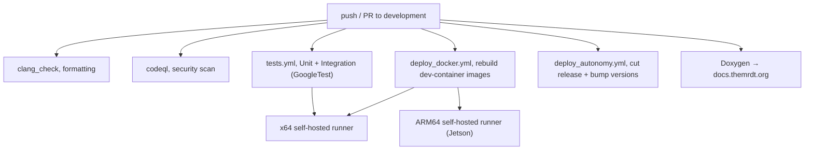
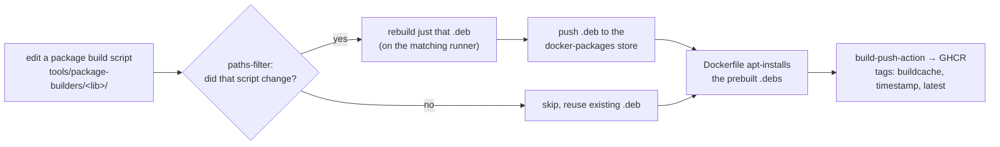

# GitHub, CI/CD & Docker

The CI/CD pipelines are some of the most important infrastructure we have, and when they break the whole team slows down, so it's worth taking the time to understand them. This page covers the org and repos quickly and then goes into how the tests and the Docker image system actually work, along with what you have to keep running for any of it to work at all.

## Organization

- Org: [github.com/MissouriMRDT](https://github.com/MissouriMRDT)
- Project boards (sprints): [orgs/MissouriMRDT/projects](https://github.com/orgs/MissouriMRDT/projects). Milestones are tracked per-repo.
- Access is managed with GitHub Teams, and the one you'll touch the most is `software-review`, since open PRs auto-assign a reviewer from it.

:::tip[ACTION]
Make sure org owner (or at least maintainer) rights get handed to you in person, and that you control `software-review` membership.
:::

## The repos that matter

| Repo | Language | Purpose |
|---|---|---|
| `Autonomy_Software` | C++20 | Autonomous traversal and detection (runs on the rover) |
| `Basestation_Software_Blazor` | C#/Blazor | Operator UI |
| `RoveSoSimulator` | Unreal 5 | Rover simulator (authoritative copy on CCF GitLab) |
| `RoveComm_CPP` / `_CSharp` / `_Python` | C++/C#/Py | Protocol libraries |
| `RoveComm_Base` | n/a | Shared RoveComm / manifest source |
| `Differential_GPS` | Python | RTK GPS / Nav board |
| `basestation_camera_server` | Rust | UDP to WebRTC camera relay |
| `RoveSoDocs` | n/a | Hosts the generated Doxygen docs |

## Branching & PR standards

The default branch is `development` on the mature repos (`Autonomy_Software`, `Basestation_Software_Blazor`, and `RoveComm_CPP`), and the newer ones use `main` (`Differential_GPS`). There's no separate production branch, because `development` is what runs at competition, and we tag and release off of it.

Branch names follow `feature/<desc>`, `hotfix/<desc>`, or `testing/<place>`, and some real examples from the history are `feature/extended-kalman-filter`, `hotfix/rockpick`, and `testing/rolla`. Keep commit messages and PR titles under 50 characters, and every PR gets reviewed by someone on `software-review` before it merges.

## The big picture of CI

Most of the heavy CI lives in `Autonomy_Software`, and everything triggers on PRs and pushes to `development`, plus a manual "Run workflow" button.

There are two things worth knowing up front. A lot of this runs on our own self-hosted runners rather than GitHub's cloud, and the Docker images are built in a way that avoids recompiling the huge libraries every time. Both of those are covered below.

## How the unit and integration tests work

`tests.yml` runs on a self-hosted x64 Linux runner and builds a matrix of two jobs, `Unit` and `Integration`, in parallel. There's an ARM64 test job in the file too, but it's currently commented out, so right now the tests only run on x64. The tests themselves are GoogleTest, and they live in `tests/Unit/` and `tests/Integration/`.

The job is careful about a few things that are easy to get wrong:

1. It keeps a persistent checkout at `/opt/Autonomy_Software` on the runner, then fetches and hard-resets to the PR's branch each run.
2. It only initializes the `external/threadpool` and `external/rovecomm` submodules, and it explicitly makes the `data/LiDAR` submodule a no-op. That part is deliberate, because the LiDAR data is gigabytes of point clouds and pulling it on every test run would be miserable.
3. It builds with `cmake -DBUILD_TESTS_MODE=ON -DENABLE_LIDAR_GEO_UTESTS=OFF .. && make -j8`, then runs `ctest -L UTest` (or `ITest` for integration) and writes JUnit XML output.
4. If a test directory doesn't exist yet it skips cleanly instead of failing, and it wipes `/opt/Autonomy_Software` when it's done.

So when you add a test, drop it in the right `tests/Unit` or `tests/Integration` folder with the matching CTest label and it gets picked up automatically. Coverage gets reported to Codacy by `coverage.yml`.

## How the Docker image system works

This is the part that's worth understanding properly, because it confuses people the first time they look at it.

The dev environment is two Docker images, both defined in `.devcontainer/`. The first is `autonomy-jammy`, which is Ubuntu 22.04 on AMD64 for everyone's dev laptops, built from `Jammy.dockerfile`. The second is `autonomy-jetpack`, which is NVIDIA JetPack 6 on ARM64 for the rover's Jetson, built from `JetPack.dockerfile`.

The naive way to build these would be to compile OpenCV, PyTorch, the ZED SDK, PCL, FFmpeg, GeographicLib, Quill, GoogleTest, and libdatachannel from source inside the Dockerfile, which takes hours, so we don't do that. Instead, we precompile each of those into a `.deb` package and only rebuild the ones that actually changed.

The way it works is that each heavy library has a build script under `tools/package-builders/<lib>/` that produces a `.deb` package. `deploy_docker.yml` uses a path filter to check which build scripts actually changed in the PR, and it only rebuilds the `.deb` for a library whose script changed, then pushes that new `.deb` to our `docker-packages` store while reusing everything else. The Dockerfiles then just `apt install` those prebuilt `.deb`s, so the actual image build is fast. A shared `time-and-date` job runs first and produces a single timestamp so that every image from a run shares the same tag, and then `build-and-push-jammy` and `build-and-push-jetpack` use `docker/build-push-action` to build and push to GHCR with three tags: `buildcache` for the registry build cache, the shared timestamp like `YYYY-MM-DD-HH-MM-SS`, and `latest`, which gets added when it merges to `development`.

So when you bump a library version, you edit its package-builder script, and that one change is what tells CI to rebuild that single `.deb` and roll a new image. You don't touch the Dockerfile's install list for a version bump.

## What you have to set up: the two runners

All of the above only works because of two self-hosted GitHub Actions runners, and this is the piece that tends to quietly break and stall the whole team, so keep an eye on it.

| Runner | Label | What it runs |
|---|---|---|
| A Linux computer (this is the [AutoPC](../infra/infrastructure#autopc-sdelc)) | `[self-hosted, linux, X64]` | Unit/Integration tests, the AMD64 package rebuilds, the `autonomy-jammy` image, and the release job |
| A Jetson (ARM64) | `[self-hosted, linux, ARM64]` | The ARM64 package rebuilds and the `autonomy-jetpack` image, since it has to build natively on real ARM64 hardware |

If either runner goes offline, every job that targets its label just queues forever and the pipeline looks stuck. You register a runner under Org (or repo) → Settings → Actions → Runners → New self-hosted runner, then install it as a service with the correct labels. The Jetson has to be one of these runners because the JetPack ARM64 image can only be built on ARM64 hardware.

:::tip[ACTION]
Confirm both runners are registered and online under Org → Settings → Actions → Runners. The x64 computer and the Jetson both need the runner service installed and set to start on boot. If autonomy won't build or the images won't update, this is the first place to check.
:::

## What deploy_autonomy actually does

`deploy_autonomy.yml` runs on the x64 self-hosted runner, and on a push to `development` it cuts a versioned GitHub Release and then opens an automated PR (`topic/update-versions` into `development`) that bumps the software version numbers. It uses `secrets.SSH_PRIVATE_KEY` to push that version-bump branch to GitHub over SSH. It does not SSH into the Jetson and copy a binary, because the Jetson runs autonomy out of the `autonomy-jetpack` image and a local build. So "deploy" here really means tagging a release and bumping versions, rather than pushing bits to the rover.

## Keeping the RoveComm manifest in sync

`manifest.yml` and `sync-rovecomm.yml` keep the [RoveComm manifest](./rovecomm#the-manifest-the-single-source-of-truth) consistent across the language ports. You edit the manifest at its source and let the sync propagate it, and you never hand-edit a downstream copy.

## The dev container (for members, not CI)

Members don't install the C++ toolchain by hand, they open the repo in a VSCode dev container. `.devcontainer/devcontainer.json` pins a specific GHCR image tag like `ghcr.io/missourimrdt/autonomy-jammy:2026-05-01-15-42-01`, runs the container with `--gpus all`, `--network host`, and `--privileged` so it can reach the ZED camera and USB devices, and bind-mounts the ZED resources and calibration folders. Everything is baked in, including CUDA 12.2, GCC-10, OpenCV 4.11, PyTorch 2.2.2, ZED SDK 4.1, Quill, GoogleTest, GeographicLib, DuckDB, PCL, and the rest.

For a new member, the flow is to install Docker, VSCode, and the Dev Containers extension, clone with `--recurse-submodules`, then "Reopen in Container" and build. The whole point of it is that nobody should ever have to install CUDA and the ZED SDK by hand again.
