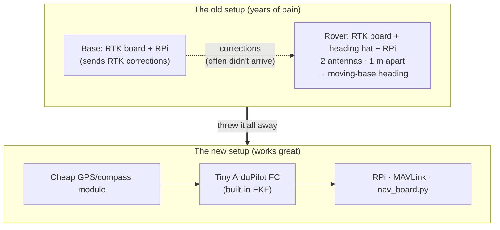

# GPS, the Differential GPS / Nav Board

:::tip[This is new this year]
This was a big reliability win, and it lives in the `Differential_GPS` repo. It replaces our older GPS handling with an RTK and EKF setup that gives us both a precise position and a heading we can actually trust.

It matters because the [URC rules](../reference/links) strongly encourage differential GNSS, and the [Autonomy mission](../subteams/autonomy#what-the-mission-actually-requires) has to reach the GNSS-only targets within 3 meters, so a precise position turns directly into points.
:::

## Hardware

The setup is a Raspberry Pi 4 or 5 as the companion computer (the "nav-board"), an ArduPilot flight controller (an ARK FPV, Pixhawk, or Cube) that we use purely as a sensor-fusion brain, and a u-blox GPS and compass module (an F9P dual-antenna RTK, or an M8P, with an integrated magnetometer). The Pi talks to the flight controller over USB using MAVLink 2.

## Data flow

`nav_board.py` runs as the `nav_board` systemd service. It reads the EKF-fused position and heading off the flight controller and broadcasts it over RoveComm as the Nav board at `192.168.2.104`.

| Packet | Data ID | Payload |
|---|---|---|
| `GPSLatLonAlt` | `6100` | `[lat, lon, alt, h_acc, v_acc, hdg_acc, fix_type, is_differential]` (fix types follow u-blox NavPVT) |
| `CompassData` | `6102` | `[heading]` 0–360° (EKF-fused) |
| `SatelliteCountData` | `6103` | `[num_satellites]` |

## Gotchas that will bite you

:::danger[Rover EKF tuning is mandatory]
Rovers drive backwards and slip sideways, and the default drone EKF panics and snaps the heading 90 or 180 degrees when that happens, so you have to force it to trust the compass:
- `EK3_SRC1_YAW = 1` (compass), `EK3_GSF_USE_MASK = 0`, `COMPASS_LEARN = 0`
- `SERIAL0_PROTOCOL = 2` (MAVLink 2), `SERIAL0_BAUD = 115200`
:::

A few more things that will trip you up. You need to disable `ModemManager` on the Pi, because it spams AT commands at the flight controller and deadlocks MAVLink, and you need to add the user to the `dialout` group. There are two USB ACM ports, where `ttyACM0` is MAVLink and `ttyACM1` is SLCAN/CAN, and sending MAVLink to the CAN port instantly crashes it, so the script auto-picks the lower port and you can override it with `--serial-path /dev/ttyACM0`. Mount the puck away from the motors and power wires to avoid EMI, and do the full compass calibration dance after it's mounted, or the heading drifts depending on which way you're facing. One last thing: a stationary single-antenna setup reads `360.0` for heading accuracy until you drive a few meters, which is expected, and a dual-antenna RTK setup fixes that.

## The history: why we rebuilt the GPS

We spent years fighting the old GPS setup before we landed on the current one, and knowing what we already tried will keep you from rebuilding your way back into the same problems. The obstacle-avoidance story under [Autonomy](../subteams/autonomy#why-usgs-lidar-the-origin-story) is a similar kind of lesson.

The old way was a moving-base RTK setup. We ran RTK boards to get differential GPS, with one board and a Raspberry Pi at base station, and another board with a heading hat plugged into a Raspberry Pi on the rover. The rover had two antennas spaced about a meter apart, and the local differential between those two antennas gave us an absolute heading, which is what makes it a moving base. That moving-base position was then corrected using the RTK corrections coming from base station.

We abandoned it in stages. It was really complicated and fragile to begin with, because when our radio signals went red it corrupted the GPS, and sometimes the RTK corrections just didn't come through at all, so we actually ended up worse with the corrections on than off. We dropped the base-station side entirely and kept only the rover's two-antenna moving-base heading. Then, after a couple of years of it working fine, the heading randomly stopped working. We swapped GPS pucks, re-checked every connection, and moved the pucks around, and the heading would still either not come through or be off by 90 or 180 degrees, and it was non-deterministic, so we could start in the exact same spot twice and get different answers. At that point we threw the whole complicated, hardware-heavy thing out and moved to a tiny flight controller with a cheap GPS and compass module, let ArduPilot's built-in EKF do the fusion, and wrote a Python script that reads the EKF output over MAVLink from a Raspberry Pi. It worked incredibly well, and it's what we'll most likely keep using.

One thing that's worth being clear about is that base-station differential correction is not currently set up or wired at all. The architecture leaves the door open to apply differential corrections over MAVLink from a separate module at base station if we ever want even better accuracy, but right now it's just the rover-side flight controller and module, so treat it as a future project rather than something that's running.

:::note[Heading now comes from the magnetometer, not two antennas]
In the new setup, the heading is the EKF-fused compass output, which is why all of the [EKF tuning above](#gotchas-that-will-bite-you) is about forcing it to trust the compass. The old `360.0`-until-you-move quirk and the dual-antenna notes only apply to the legacy moving-base rig, not the current cheap-module setup.
:::
