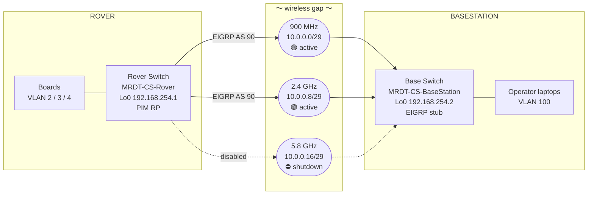
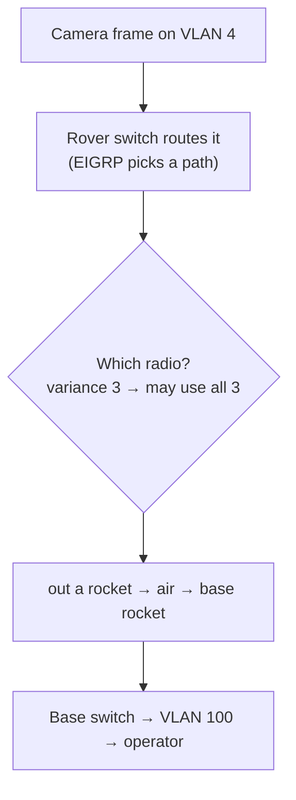

import NetworkTopology from '@site/src/components/visuals/NetworkTopology';

# The Network

The network is barely documented anywhere, and it's the thing you'll be digging through at competition when something won't connect, so read this page twice. Everything here came straight out of the live Cisco switch backups in `NetworkSwitchBackups/2026-0415/` and the RoveComm manifest, not from memory.

## Start by clicking around

Before you get into the details, it helps to get a feel for the shape of it, so click on any board, switch, or radio band below.

<NetworkTopology />

:::danger[DO NOT UPGRADE THE SWITCH FIRMWARE]
Both switches print this in their login banner:

> "DO NOT UPGRADE FIRMWARE OR YOU WILL LOSE ROUTING LICENSING!"

The Layer-3 routing (EIGRP, inter-VLAN, and PIM multicast) all depends on the `network-advantage` license tier that's baked into the current IOS, so if you flash a new image you can brick our routing until someone re-licenses it. If a switch is misbehaving, reboot it or restore a backup config, and do not just update it.
:::

## The IP plan is laid out on purpose

The most useful thing to know up front is that a device's subnet tells you what it is. We segment by function using VLANs, and the third octet matches the VLAN number, so once that clicks you can read the network in your head.

| Subnet / VLAN | Meaning | Gateway (switch SVI) | Example members |
|---|---|---|---|
| `192.168.2.0/24`, VLAN 2 `CoreSystems` | Power and control boards | `192.168.2.1` | Core `.110`, PMS `.102`, Nav `.104`, Arm `.107`, Auger `.108` |
| `192.168.3.0/24`, VLAN 3 `AutonomyAndSensors` | Compute and science | `192.168.3.1` | Autonomy `.100`, IRSpectrometer `.104`, Raman `.105` |
| `192.168.4.0/24`, VLAN 4 `Cameras` | Camera streams | `192.168.4.1` | Camera1 `.100`, Camera2 `.101`, CameraServer `.102` |
| `192.168.100.0/24`, VLAN 100 `BaseStation` | Operator-side hosts | `192.168.100.1` | SignalStack `.101`, BaseStationNav `.112` |
| `192.168.254.0/24` | Switch loopbacks / mgmt | n/a | RoverSwitch `.1`, BaseSwitch `.2` |
| `10.0.0.0/24` (sliced into `/29`s) | Wireless rocket links | n/a | see [wireless](#the-wireless-gap-the-rockets) |
| `239.0.0.0/8` | Multicast camera streams | n/a | `239.0.0.1–10`, UDP `50000` |

:::note[Why function-based VLANs?]
We segment like this to have more control over where traffic goes and what priority it gets across the wireless bands. By splitting the devices into separate subnets based on how heavy or how important their traffic is, we can let a dynamic routing protocol automatically steer each class of traffic down the right radio, so the motor and telemetry traffic keeps flowing while the cameras get throttled. That split is what makes the [Babel QoS scheme](./babel#qos-guaranteeing-the-joystick) possible, where the control traffic on VLANs 2 and 3 gets priority and the camera traffic on VLAN 4 is the first thing we sacrifice when a link gets congested. The full reasoning is in the Babel repo README.
:::

## The physical topology

The rocket radios run as transparent Layer-2 bridges, so each `/29` has the rover-switch L3 interface on one end and the base-switch L3 interface on the other, with the two radios sitting invisibly in the middle just turning Ethernet into RF and back.

## The wireless gap (the "rockets")

We bridge the rover and base with three Ubiquiti Rocket radio pairs at three different frequencies, which gives us frequency diversity for when one band gets congested or blocked. Each band is its own clean `/29`.

| Band | Subnet | Rover sw IF | Base sw IF | Rover rocket | Base rocket | State |
|---|---|---|---|---|---|---|
| 900 MHz | `10.0.0.0/29` | `Gi1/1` → `.1` | `Gi1/0/12` → `.2` | `.3` | `.4` | 🟢 active |
| 2.4 GHz | `10.0.0.8/29` | `Gi1/2` → `.9` | `Gi1/0/13` → `.10` | `.11` | `.12` | 🟢 active |
| 5.8 GHz | `10.0.0.16/29` | `Gi1/3` → `.17` | `Gi1/0/14` → `.18` | `.19` | `.20` | ⛔ shutdown on rover |

:::warning[The 5.8 GHz link is currently OFF]
On the rover switch, `interface Gi1/3` (5.8 GHz) has `shutdown` in its config, so only 900 MHz and 2.4 GHz are live right now. That's also why the Babel prototype only wired up two radios. If you want all three bands, re-enable and re-test 5.8 GHz before competition.
:::

:::note[Why is 5.8 GHz shut down?]
We dropped 5.8 GHz this year because its range was so short that it only really helped at very close range with direct line of sight, and even then 2.4 GHz gave us the same performance, so 2.4 just took over that close-range role. On top of that, the 5.8 GHz Ubiquiti Rocket's ethernet port is only Fast Ethernet at 100 Mbps, so it never actually added any usable bandwidth over 2.4 in the first place. So we run 900 MHz and 2.4 GHz only, with 900 as the long-range fallback and 2.4 handling everything else.
:::

### Radio config and antennas

The rockets run in transparent bridge mode, which is why they're invisible to the routing (see the topology above). For the antennas, we use a sector for 2.4 GHz, and for 900 MHz we use a yagi on the basestation side and two omnis on the rover side. This is all shared with the electrical and signal-stack folks, so coordinate with them on the RF tuning and aiming.

## Routing: EIGRP AS 90 (today)

Both switches run EIGRP autonomous system 90, and there are a couple of details worth knowing. With `maximum-paths 3` and `variance 3`, EIGRP load-balances across all three radio links at once even when their costs are unequal, so it's not just using one link at a time, and when all the bands are up it spreads the traffic across them. It also runs `bfd all-interfaces` with `hello 1 / hold 3` on the radio links, so Bidirectional Forwarding Detection fails a dead link over in milliseconds instead of waiting on the routing timers. The base switch is set up as an EIGRP stub with `eigrp stub connected summary`, so it only advertises its own connected networks, which keeps the topology simple and the query traffic low.

## Multicast: how camera video crosses the gap

The camera streams are UDP multicast on `239.0.0.1` through `239.0.0.10`, port `50000`. Unicast routing protocols don't carry multicast, so the switches run PIM dense-mode on every VLAN SVI, and the rover switch loopback `192.168.254.1` acts as the PIM Rendezvous Point for the whole network. The base switch runs `ip multicast-routing distributed`. This is the same reason the Babel proposal has to run PIM on the Pis too, because otherwise the camera feeds die the moment you leave the Cisco world. See [Babel](./babel) for more on that.

| Stream | Multicast IP | | Stream | Multicast IP |
|---|---|---|---|---|
| DriveCamLeft | `239.0.0.1` | | AuxCam1 | `239.0.0.6` |
| DriveCamRight | `239.0.0.2` | | AuxCam2 | `239.0.0.7` |
| GimbalCamLeft | `239.0.0.3` | | AuxCam3 | `239.0.0.8` |
| GimbalCamRight | `239.0.0.4` | | AuxCam4 | `239.0.0.9` |
| BackCam | `239.0.0.5` | | Microscope | `239.0.0.10` |

## Security and hygiene

The live configs already lock a lot down. We run SSH v2 only with no telnet and no HTTP server, DHCP snooping on all the VLANs, BPDU guard and PortFast on the access ports, rapid-PVST spanning tree, SNMP v3, and a legal-warning banner on login.

:::danger[Credentials live in the backup files, treat them as sensitive]
Both switch backups contain the `enable secret` and `admin` password hashes. The rover uses type 9 (scrypt), which is strong, but the base uses type 5 (MD5-crypt), which is crackable on modern hardware. So rotate the base switch password to a type-9 secret, keep these backups out of any public repo, and store the real credentials in [VaultWarden](../infra/infrastructure) rather than in plaintext anywhere.
:::

## Quick-reference: switches

| | Rover | Basestation |
|---|---|---|
| Hostname | `MRDT-CS-Rover` | `MRDT-CS-BaseStation` |
| Model | Cisco IE3300/IE3200 (industrial, PoE, `network-advantage`) | Cisco `WS-C3560CX-12PD-S` |
| IOS | 17.9 | 15.2 |
| Loopback0 | `192.168.254.1/32` | `192.168.254.2/32` |
| VTP domain | `MRDT-ROVER` (transparent) | `MRDT-BASESTATION` (transparent) |
| EIGRP | AS 90 | AS 90 (stub) |
| Multicast | PIM RP | `ip multicast-routing distributed` |

The current EIGRP setup is solid wired technology, but it struggles on a mobile, lossy wireless link, and the proposed fix is a pair of Raspberry Pi edge routers running [Babel](./babel).
