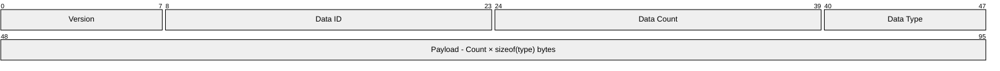
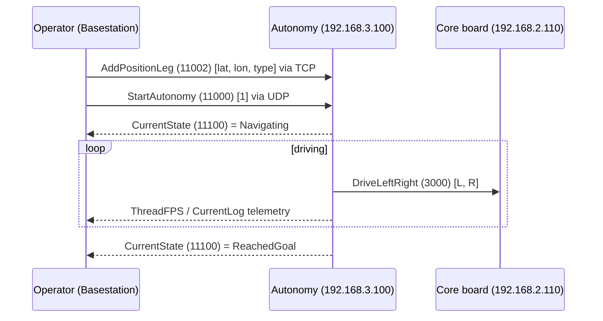

import RoveCommPacket from '@site/src/components/visuals/RoveCommPacket';

# RoveComm, our custom protocol

RoveComm is the language every part of the rover speaks. It's a small fixed-header binary protocol that runs over UDP, and over TCP when we need delivery to be guaranteed, and we kept it dead simple on purpose so that an STM32 microcontroller can speak it just as easily as the Jetson can.

## Transport & ports

| | UDP | TCP |
|---|---|---|
| Production | `11000` | `12000` |
| Simulation | `11001` | `12001` |

We use UDP for the high-rate stuff like telemetry and drive commands, where low latency matters a lot more than guaranteed delivery, and we use TCP for the things that have to arrive like config and waypoint lists. A node subscribes to another node's IP to start receiving its telemetry, and you get up to 10 UDP subscribers per node while the server thread tracks up to 120 IPs.

## The packet: a 6-byte header + payload

- **Version** (byte 0) - must be `3` or the sender gets `INVALID_VERSION` back.
- **Data ID** (bytes 1–2, big-endian) - identifies the packet type; IDs are namespaced per board by range (e.g. `11000` = StartAutonomy).
- **Data Count** (bytes 3–4, big-endian) - number of *elements* in the payload, not bytes.
- **Data Type** (byte 5) - enum value from the type table below.
- **Payload** (byte 6+) - `Count × sizeof(type)` bytes, each element in network byte order (`htons`/`htonl`/`htonll`).

| Type | Value | Bytes | | Type | Value | Bytes |
|---|---|---|---|---|---|---|
| INT8_T | 0 | 1 | | UINT32_T | 5 | 4 |
| UINT8_T | 1 | 1 | | FLOAT_T | 6 | 4 |
| INT16_T | 2 | 2 | | DOUBLE_T | 7 | 8 |
| UINT16_T | 3 | 2 | | CHAR | 8 | 1 |
| INT32_T | 4 | 4 | | | | |

There are a handful of reserved system packet IDs: `PING=1`, `PING_REPLY=2`, `SUBSCRIBE=3`, `UNSUBSCRIBE=4`, `INVALID_VERSION=5`, and `NO_DATA=6`. A few other globals worth knowing are the target `updateRate` of 100 Hz, the `headerLength` of 6, and the `DE:AD` MAC prefix that all of our boards' MACs start with. The MAC prefix is just an arbitrary value and nothing actually filters on it.

## Try it: build or decode a packet

The fastest way to understand the header is to watch the bytes change. Build a packet from a Data ID, type, and values and see the exact wire bytes, or paste bytes you sniffed off the network and decode them back into fields. The colors map to the [header diagram above](#the-packet-a-6-byte-header--payload).

<RoveCommPacket />

## A real command, end to end

## The Manifest, the single source of truth

`RoveComm_CPP/data/RoveComm/manifest.json` defines every board, its IP, and every command, telemetry, and error packet, including the `dataId`, `dataType`, `dataCount`, and a human comment. CI code-generates it into headers for every language (`RoveCommManifest.h`, `.cs`, and the Python `manifest.json`), and the `sync-rovecomm` workflow keeps all of those copies consistent with each other.

:::danger[The #1 RoveComm rule]
Always edit the manifest at the source repo and let CI sync it out. If you hand-edit a manifest copy inside a downstream repo, the copies silently drift apart, and you will end up spending a competition afternoon trying to figure out why Autonomy and Basestation disagree on a packet.
:::

The full board and IP table lives in the [Reference Board Table](../reference/board-table), and it's also clickable on the [Network](./network) page.

## Library variants

| Library | Used by | Notes |
|---|---|---|
| `RoveComm_CPP` | Autonomy (Jetson) and other larger computers | not for microcontrollers, the embedded team has lightweight C variants |
| `RoveComm_CSharp` | Basestation | submodule |
| `RoveComm_Python` | GPS / Nav board | submodule in `Differential_GPS` |
| `RoveComm_Base` | shared assets / manifest source | |

In Autonomy the global instances live in `AutonomyNetworking.h` as `network::g_pRoveCommUDPNode` and `network::g_pRoveCommTCPNode`, each with its own atomic status flag.

## Why RoveComm exists

RoveComm was written to bridge the gap and fix the problem of communicating between all of our different software stacks. The simulator, Autonomy, Basestation, and the embedded controllers all need to talk to each other, and they're all written in different languages, so we build a RoveComm implementation once in each language as a thin wrapper around the OS sockets library. After that, everything is updated through the [manifest](#the-manifest-the-single-source-of-truth), which is pulled in as a submodule, so when a packet changes every stack picks it up automatically.

The obvious question is why we don't just use something like ROS, or MQTT, or DDS. If we used ROS we would be locked into its ecosystem, and it would actually become more difficult to communicate between our custom simulator, autonomy, basestation, and embedded controllers, whereas RoveComm stays lightweight and completely in our control. Plus, rolling our own protocol instead of using something off the shelf is one of the best ways we have to build good engineers. It gives students a real place to use the knowledge they already have and to learn new things about network algorithms, multithreading, and the like. We build engineers. If we just imported plug-and-play ROS modules like a lot of other teams do, we would be like all the other teams, and that's a big part of why we're world class and why we won competition twice in a row.

### A little history

RoveComm has been through three wire versions so far. V1 was written by an early rover member named Eli Vogel, and not much about it is documented anymore. We know almost nothing about V2. The current V3 was written by Donovan Bale, Brady Tappel, and Clayton Cowen, and it's the version that every current stack speaks.
