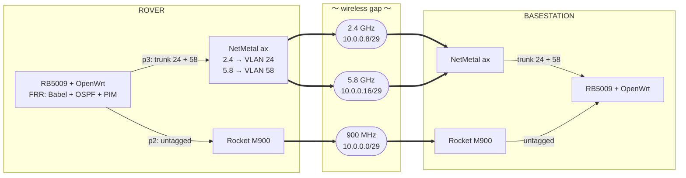

import SignalLab from '@site/src/components/visuals/SignalLab'

# Signals, the wireless link upgrade

[Babel](./babel) optimizes how we route traffic across radio links. This page outlines the hardware upgrades to those links. We cover the new radio replacing the Ubiquiti Rockets, the specific antennas required, and how to read a spec sheet to avoid overpriced equipment.

:::note[Status: designed here, nothing bought yet]
None of this has been purchased or bench-tested. Prices are from August 2026 and will fluctuate. Rule numbers cite the **URC 2026 Requirements and Guidelines**. Always check these numbers against the current year's document.
:::

## What we run today

| Band | Radio | Base antenna | Rover antenna | State |
|---|---|---|---|---|
| 900 MHz | Ubiquiti Rocket M900 | Ubiquiti yagi | omni | 🟢 the long-range lifeline |
| 2.4 GHz | Ubiquiti Rocket M2 | 90° sector | omni | 🟢 does the real work |
| 5.8 GHz | Rocket pair | n/a | n/a | ⛔ [shut down on the rover](./network#the-wireless-gap-the-rockets) |

We disabled 5.8 GHz because its Fast Ethernet port bottlenecked the bandwidth and its physical range overlapped entirely with 2.4 GHz. A modern radio solves both hardware problems.

:::warning[The M900 has to be sub-band agile now, rule 3.b.v]
900 MHz is no longer a band you can tune once and forget. Channels must be **8 MHz or narrower**. The radio must stay exclusively inside whichever of three sub-bands the schedule assigns for that mission: 902-910, 911-919, or 920-928 MHz. This covers the rover and C2 LANs alongside the air link, and spectrum monitoring is active on site.

**ACTION:** Confirm the M900 can retune across all three bands at 8 MHz and that a team member can configure it in the field during the [15 minute setup window](#the-rules-that-shape-this).
:::

The range issue requires a closer look. At 1 km, free space loss on 5.8 GHz is roughly 108 dB, and a mid-gain sector hitting a small omni lands around **-65 dBm** against a receiver that needs about -70 for its top useful rate. That is a handful of dB of margin at the top rate, not the twenty the free space number alone would suggest.

The difference is the ground. A 3 m mast talking to an antenna 1.2 m off the dirt never gets a free space path: the reflected ray comes back nearly as strong as the direct one and phase-flipped, so the two partly cancel. Past roughly **4π·h₁·h₂/λ** — about 875 m for a 3 m mast at 5.8 GHz — that cancellation deepens and loss climbs as the fourth power of distance instead of the second. Drop the mast from 3 m to 1 m on an otherwise perfect path and you pay **9 dB** for nothing.

That is why geometry, not gain, destroys these links. Terrain blocks the Fresnel zone, the ground bounce quietly eats the budget the free space number promised you, rover pitch pushes the base station into an antenna pattern null, and mounting elements directly to a metal chassis ruins the signal shape.

**Stop shopping for more antenna gain and start fixing the RF path.** That is the core lesson of this upgrade.

## The new radio: MikroTik NetMetal ax

We need one **NetMetal ax** per side. The US version is part `L23UGSR-5HaxD2HaxD-NM` and costs roughly $169. It replaces the Rocket M2 and revives the 5.8 GHz link on the same unit.

| Parameter | Value |
|---|---|
| Radios | 2.4 GHz 2-chain and 5 GHz 2-chain, Wi-Fi 6, **concurrent** |
| Max PHY rate | 574 Mbit/s on 2.4, 2400 Mbit/s on 5 |
| Connectors | 2× RP-SMA female, **both bands diplexed onto the same pair** |
| TX power, 5 GHz | 28 dBm at the bottom rate, falling to 20 dBm at MCS11 |
| Sensitivity, 5 GHz | -96 dBm at MCS0, -70 at MCS9, -67 at MCS11 |
| Power in | Passive PoE 18 to 28 V, or DC jack 12 to 28 V |
| Enclosure | IP66, -40 to +70 °C |
| Expansion | MiniPCIe slot, nano-SIM, USB, SFP |

| | Rocket M2 (today) | NetMetal ax |
|---|---|---|
| Radios per side for 2.4 and 5.8 | 2 | **1** |
| Bands per radio | 1 | 2, at the same time |
| Ethernet | 100 Mbps | Gigabit, plus SFP |
| PHY | 802.11n, 2×2 | 802.11ax, 2×2 per band |
| Power input | 24 V passive PoE through an injector | **18 to 28 V, straight off the rover rail** |
| Spares and firmware | M series is end of life | current product |

Look at the power specifications first. The rover bus can feed this radio without an injector, but we must confirm the exact bus voltage. This is the [same open question the RB5009 router has](./babel#what-this-does-not-solve). The MiniPCIe slot is highly valuable because it accepts LoRa or LTE modules for a cheap, independent low-band control link.

:::warning[Two parts to avoid, both discontinued]
The **NetMetal ac²** (the predecessor) and the **mANTBox 52 15s** (an otherwise perfect integrated dual-band sector) are both discontinued by MikroTik. Buying liquidation stock for a multi-year program is a mistake because you lose access to spare parts and firmware updates. Always check the official manufacturer product page rather than a reseller listing.
:::

## How many antennas and which ones to buy

The NetMetal ax puts **both radios on the same two RP-SMA connectors** via a diplexer. The MikroTik product page does not make this obvious, but the hardware consequence is strict. **Whatever antenna you choose must cover both bands, or you forfeit an entire radio.** This disqualifies standard Ubiquiti airMAX and MikroTik mANT sectors because they are strictly 5 GHz.

The system requires **two RF paths per side**. Both must be dual-band and dual-polarized.

| Where | What | Qty | Why |
|---|---|---|---|
| Base | Dual-band dual-polarized panel, 2× N-female | 1 | one antenna handles two ports, both chains, and both bands |
| Base | LMR-240 jumper, 2 ft, N-male to RP-SMA male | 2 | one per port, keep them as short as possible |
| Rover | MikroTik HGO-antenna-OUT, RP-SMA male | 2 | 3.6 dBi at 2.4, 6.7 at 5, weatherproof, screws straight on |
| Rover | RP-SMA male to female extension pigtail, 12 in | 2 | moves the elements onto a mast and away from the metal chassis |

The 900 MHz Rocket M900 keeps its yagi and its rover omnidirectional antennas. That system remains untouched.

:::tip[A dual-band antenna is not the same antenna on both bands]
An aperture keeps its physical size, not its beamwidth. Moving from 5.8 GHz down to 2.4 GHz stretches every beamwidth by the wavelength ratio of **2.38×**. A panel has two dimensions of aperture and gives up `20log₁₀(2.38) ≈ 7.5 dB`; a vertical omni has only one and gives up `10log₁₀(2.38) ≈ 3.8 dB`. That is exactly why the rover omni is spec'd 6.7 dBi at 5 GHz and 3.6 dBi at 2.4.

So the SignalPlus panel is an 18 dBi, 20°×20° sector on 5.8 GHz and roughly a **12.6 dBi, 48°×48°** sector on 2.4. Do not budget it as 18 dBi on both. The upside is that the wider 2.4 GHz beam is far more forgiving of a rover that has wandered off boresight, which is a sensible division of labour: 5.8 for rate inside the corridor, 2.4 for coverage outside it.
:::

**The rover antennas must be deliberately low gain.** A high-gain omnidirectional antenna creates a signal shaped like a thin, flat donut. When the rover drives onto a steep incline, that donut tilts, and the base station drops entirely out of the signal path. On a 1 km link with 22° of vehicle pitch, a 9 dBi antenna lands **20 dB down its own pattern**, leaving the rover on -85 dBm and a weak MCS4. A 3 dBi element on the exact same link is only 1.7 dB off its peak, holding -72 dBm and MCS8.

The smaller antenna performs **12 dB better** in this scenario because a 9 dBi beam is only 14° tall, while a 3 dBi one is 57°. A 22° pitch walks the base station completely out of the high-gain beam. Using pigtail extensions on the rover matters for the same reason. An antenna bolted directly to a metal chassis creates blind spots that no amount of base station gain can fix.

## What matters on a spec sheet

Review antenna specifications in this order to guide your purchase.

| Spec | Why it matters |
|---|---|
| Band coverage | Must be dual-band. This is non-negotiable or you lose a radio. |
| Port count and polarization | Requires two ports, dual-polarized. A single-port antenna wastes half the radio. |
| Beamwidth vs claimed gain | This is where vendors inflate numbers. See the math check below. |
| Beamwidth vs coverage need | A narrow beam only provides margin if the rover stays strictly inside it. |
| Connector type and gender | Expect N-female on the antenna and RP-SMA male at the radio. |
| Weight and sail area | A 12 lb, 62 inch antenna on a tripod in high wind is a massive operational problem. |
| Weather rating | Indoor plastics degrade rapidly and will not survive desert conditions. |
| Gain | Least important, as explained in the next section. |

### The check that catches a fake spec sheet

> **D ≈ 41253 ÷ (H° × V°)**

If the claimed gain does not mathematically align with the claimed horizontal and vertical beamwidth, the vendor is lying.

| Antenna | Beamwidth at 5 GHz | Implied | Claimed | Verdict |
|---|---|---|---|---|
| SignalPlus 2×2 panel | 20° × 20° | 20.1 dBi | 18 dBi | consistent |
| RadioLabs MiMoDIR245812 | 35° × 35° | 15.3 dBi | 12 dBi | conservative |
| ALFA APA-M25 | 66° × 16° | 15.9 dBi | 10 dBi | very conservative or highly lossy |

Marketplace listings often run 3 to 5 dB optimistic. Derate any antenna claiming more gain than its beamwidth physically allows. An antenna claiming less than the theoretical maximum represents either honest insertion loss or a conservative vendor. Either way, it is a safer purchase. 

## Gain does not buy you range

At 5.8 GHz, FCC Part 15 regulations cap point-to-multipoint EIRP near **36 dBm**. The radio must reduce conducted power by 1 dB for every 1 dB of antenna gain past 6 dBi. 

On the transmit side, **every candidate antenna hits the exact same regulatory ceiling**. The signal from base to rover is identical whether you bought a $40 plastic panel or a $790 carrier-grade sector.

Receive gain is not capped by the FCC. Upgrading antenna gain does exactly one thing: **it helps your base station hear the rover better.** The rover is the weak transmitter in the link, managing roughly 26 to 30 dBm EIRP against the base station's 36 dBm. 

When you buy a high-gain antenna, you are paying for receive margin by sacrificing coverage width:

| Antenna | Received at base, 1 km | Usual rate | Link uptime | Capacity | Lateral coverage at 1 km |
|---|---|---|---|---|---|
| SignalPlus panel, 18 dBi | -65 dBm | MCS11 | 100% | 147 Mbps | ±176 m |
| RadioLabs, 12 dBi | -69 dBm | MCS8 | 100% | 125 Mbps | ±315 m |
| ALFA pair, 10 dBi | -71 dBm | MCS8 | 100% | 117 Mbps | ±649 m |

Read that table carefully, because the interesting column is the one that does not vary. **All three hold the link 100% of the drive at 1 km**, and all three carry the mission out to roughly 3.5 km. The mission needs 8 Mbps; the cheapest option here delivers 117.

So the 6 dB of extra gain buys you throughput you have no use for, and charges you **±473 m of lateral driving space** for it. Inside a narrow 350 m corridor the high-gain antenna is great. If the rover drives wider than that, the cheap wide-beam option wins outright: a rover outside a narrow beam loses the link entirely, and no amount of signal margin fixes a dead link.

Rule 3.b.iii allows a third option: **steer the antenna.** A mechanized mount driven from the C2 station is perfectly legal if you aim it using RSSI data or relayed GNSS coordinates. You just cannot aim it by eye or through a dedicated antenna camera. Active tracking turns a narrow beam from a liability into free signal margin. It is the only way a 20° sector makes sense on a wide course.

## Play with it

Drag the mast height slider on a clear path and watch the *ground bounce* line, not the Fresnel zone: 1 m of mast costs 11 dB against free space, 3 m costs 1.5, and 6 m is actually 3.6 dB **better** than free space. Nothing else on the page moves the budget that far. Then toggle the Part 15 EIRP cap to see the transmit side flatly refuse to improve with higher gain, and watch **link uptime** rather than the headline Mbps. Uptime is the bottom rung's availability — the fraction of the drive you have a link at all — and it is the number that actually fails. A link can hold its top rate only 60% of the time and still be up 100% of the time, simply running a notch slower through the fades; that is normal and fine. Uptime falling below 100% is not. The scenario buttons represent common mistakes this page is designed to prevent.

Then switch **Terrain** from *flat + ridge* to **MDRS** or **Rolla** and do the siting exercise properly. Those are real USGS heightmaps, 6 km square at 30 m resolution, over USGS orthoimagery at 3.75 m — so you can put the tripod on a specific rise, road or wash rather than a coloured blob. Drag the base station around, swing the handle to aim the sector, drag the rover to set its bearing and range, and zoom in to 8× when you need to be precise about where something sits. The *Both* layer tints the imagery by elevation if you want the contours back. At MDRS you can find headings from the same spot that swing between a clear path and 60 dB of diffraction — which is the entire argument for [siting the tripod carefully and asking for the 20 m exception](#mounting-and-cabling), made concrete.

<SignalLab />

## Mounting and cabling

:::danger[The 25 m of cable is Ethernet, not coax]
The C2 station is typically a metal trailer with the course deliberately blocked from view to comply with rule 2.b.i. Rule 3.b.iv says teams "should bring at least 25 m of communications cable" to reach an antenna placed outside. 

It specifies *communications cable*. Do not use coax. Running 25 m of LMR-400 coax loses roughly **18 dB** of signal at 5.8 GHz. You must mount the radio directly at the antenna, feed it over a long PoE Ethernet run, and keep all coax jumpers under one meter.

The failure here is deceptive. If you run 25 m of coax on a flat bench test at 1 km, the link survives and merely drops from MCS11 to MCS6. Link uptime stays at 100%, the airtime figure only moves from 6% to 11%, and you would very likely ship it. What you actually did was spend the 18 dB of slack meant to push a signal over a ridge.

Stack anything else on top and it collapses, and it collapses in the column you were not watching. Coax plus 22° of rover pitch drops both directions to the bottom rung and takes **link uptime from 100% to 53%** — the airtime is a comfortable 74%, so the throughput arithmetic still says yes while the link itself is gone half the drive. Coax plus a real 8 m ridge finishes it: 46% uptime and no video past about 500 m. Watch uptime, not Mbps.
:::

Throw away the cheap RG58 coax jumpers bundled with consumer antennas. RG58 loses about 1.4 dB per meter at 5.8 GHz. Using the standard 5 m leads included with the antenna costs you 7 dB per side.

**Mount the sector flat.** A 15 dBi, 90° sector has an extremely tight 7° vertical elevation beam. If you apply a 10° downtilt from a 3 m mast, you will drive the main lobe straight into the dirt 17 m in front of you.

**Mast height is your dominant variable, and rule 3.b.iv caps it at 3 m.** This is a hard constraint, not a design choice, and it costs you twice. The first Fresnel zone at 1 km requires 3.6 m of clearance at the midpoint on 5.8 GHz and 5.6 m on 2.4 GHz, so a 3 m mast cannot physically clear rolling ground. It also parks you right at the ground-reflection crossover: at 3 m the bounce costs 1.5 dB at 1 km, at 6 m it would *give* you 3.6 dB, and at 1 m it costs 11 dB. Every metre of mast you are allowed is worth more than any antenna on the market.

Behind a real ridge the band ordering flips. On a clear 1 km path 5.8 GHz beats 2.4 by about 6 dB once you account for the panel losing 7.5 dB of gain on the lower band. Put an 8 m ridge in the path and 5.8 GHz pays **20.2 dB** of knife-edge diffraction against 2.4 GHz's **16.7 dB**, which is enough to hand the win back to 2.4 — MCS7 instead of MCS6. That 3.5 dB is real but modest, which is the point: the diffraction advantage only gets decisive as you go much lower in frequency, and that is exactly why 900 MHz remains a core part of the architecture rather than a legacy holdover.

Siting the base station is the best lever you have. Normally, the antenna base is restricted to within 5 m of the C2 station. At MDRS structures, a judge may allow you to place it **up to 20 m away** to clear buried cables or blocking structures. Always ask for this exception. Moving the tripod 20 m onto a natural rise outperforms any hardware upgrade you can buy.

## Architecture beats parts

These design choices are listed by impact. Every item here matters more than which specific antenna panel you purchase.

1. **Deploy a relay.** The rules explicitly name "radio repeaters" as deployable items that you do not need to collect mid-mission. Dropping a node on a high point before the rover drives down into a wash turns one blocked RF path into two clear ones. Budget the mass early, as a deployed relay counts against the **50 kg** rover limit.
2. **Separate control from video.** Everything discussed above rides the same two physical elements. A blockage that kills the video feed will also kill the joystick if they share a link. Keep the 900 MHz system active, or place a LoRa module in the NetMetal's MiniPCIe slot to ensure you can always drive the rover in reverse.
3. **Get the rover antennas onto a mast.** Moving elements off the metal chassis fixes radiation pattern problems that extra signal gain cannot overcome.
4. **Narrow the channel width.** Drop the channel to 10 or 20 MHz. Each halving of the channel width buys about 3 dB of noise floor margin. The mission requires 4 to 6 Mbps of H.265 video, not 2400 Mbit/s of raw throughput.
5. **Set the ACK timeout for 1 km.** Default Wi-Fi timing assumes short indoor distances and will quietly throttle a long-distance link.
6. **Add a link-loss failsafe.** Ensure the rover stops completely upon signal loss instead of driving indefinitely on its last received command. 

## How it wires into the network

Both NetMetal radios come down **one Ethernet run**. This creates a problem because [Babel measures ETX per link](./babel#the-design-whichever-box-you-run-it-on). If you bridge the two radios together, Babel sees a single link and throws away the frequency diversity we just built. 

Put each radio on its own VLAN, tag both on `ether1`, and terminate them as separate subinterfaces on the router.

That changes the [RB5009 port map](./babel#port-map) to this configuration:

| Port | Was | Becomes |
|---|---|---|
| `p2` | 900 MHz radio, `10.0.0.1/29` | unchanged |
| `p3` | 2.4 GHz radio, `10.0.0.9/29` | trunk: `p3.24` → `10.0.0.9/29`, `p3.58` → `10.0.0.17/29` |
| `p4` | 5.8 GHz radio | free, use it for the relay node |

The `/29` IP plan and the switch interfaces stay exactly as they are today.

:::warning[Test the VLAN split before you trust the ETX numbers]
If you misconfigure the VLAN tagging, both bands will still pass traffic. However, Babel will measure one blended link instead of two separate paths. Run `vtysh -c 'show babel neighbor'` and verify you see three distinct neighbors. Next, intentionally jam one band and confirm that only that specific link's ETX metric degrades.
:::

## Bill of materials

| Item | Qty | Each | Total |
|---|---|---|---|
| MikroTik NetMetal ax, `L23UGSR-5HaxD2HaxD-NM` US | 2 | $169 | $338 |
| SignalPlus 2×2 MIMO dual-band panel | 1 | ~$80 | $80 |
| LMR-240 jumper, 2 ft, N-male to RP-SMA male | 2 | ~$12 | $25 |
| MikroTik HGO-antenna-OUT, rover | 2 | ~$15 | $30 |
| RP-SMA male to female extension pigtail, 12 in | 2 | ~$10 | $20 |
| | | | **~$493** |

Swapping the panel for a pair of ALFA APA-M25s brings the total to **$428**. You pay for that savings with reduced weatherproofing and the loss of a few MCS steps. 

The naive build uses an L-com HG2458-15DP-090 antenna at $790 and a discontinued ac² radio. That setup costs **over $1,100** and delivers worse performance. 

The SignalPlus gain figures come from a marketplace listing that nobody has tested on a physical range yet. Plan your link budget with a few dB of conservative derating.

## The rules that shape this

These numbers are quoted directly from the URC 2026 Requirements and Guidelines. Re-check them against the current year, but these are exact rule parameters rather than assumptions.

| Rule | Cite | What it means for us |
|---|---|---|
| Base antenna height limited to **3 m** | 3.b.iv | Fixed constraint. Every Fresnel calculation here stems from this limit. |
| Antenna base within **5 m** of C2, guys within **10 m** | 3.b.iv | You cannot walk the antenna far away to find a better spot. |
| At MDRS structures, judge may allow up to **20 m** away | 3.b.iv | The single siting lever you have. Always ask to use it. |
| Bring **at least 25 m of communications cable** | 3.b.iv | It says cable, not coax. Use Ethernet and power the radio via PoE. |
| Rover **not expected beyond 1 km** of C2 | 2.b.ii | The fundamental design range for everything on this page. |
| Delivery Mission: LOS "**not guaranteed for more than 50%** of the course", and later tasks are placed deliberately beyond LOS | 2.b.ii, 1.c.ii | Signal blockage is an explicit course feature, not bad luck. Build the relay. |
| 900 MHz: **≤8 MHz** channels, exclusively within 902-910, 911-919, or 920-928, switchable per mission | 3.b.v | Applies to the rover and C2 LANs as well as the air link. |
| **No frequency restrictions on 2.4 GHz**, but expect crowding | 3.b.vi | Frequency hopping and auto channel selection are highly recommended. |
| Encouraged to work **outside 900 MHz and 2.4 GHz** and to get ham licenses | 3.b.vi | Direct rules support for bringing 5.8 GHz back into the stack. |
| Steered directional antennas **allowed** | 3.b.iii | Electronic control from C2 is fine, aimed on RSSI or relayed GNSS. No cameras on the antenna and no manual aiming by eye. |
| Satellite internet **not allowed** | 3.b.i | No Starlink terminals. |
| FCC compliance is yours, comms and license docs due **April 24, 2026** | 3.b.ii | Hard deadline. Any changes after this date must be officially reported. |
| Deployed items need not be recovered mid-mission | 1.a.iii | "Radio repeaters" are named explicitly as allowed drop-items. |
| Deployed relays count against the **50 kg** rover mass | 3.a.iii | Budget the mass constraint before building the hardware. |
| **15 min** to set up all comms, **10 min** to tear down | 1.a.ii | A 3 m mast and a sector antenna have to go up extremely fast, often in high wind. |
| **$24,000** cap includes base antenna, transceiver, and all C2 gear | 2.d.iii | The ~$493 proposed here easily clears the budget constraint. |

## What to do next

1. **Confirm the M900 supports 8 MHz channels across all three sub-bands** (3.b.v). If it cannot, that is a hardware limitation rather than a configuration bug. Find out immediately.
2. Confirm the rover bus voltage against the NetMetal's 18 to 28 V input requirement. 
3. Model the RF path from a 3 m mast. We already keep LiDAR databases for MDRS, Hanksville, and Tucumcari for the autonomy subteam. Push those coordinates through SPLAT!, Radio Mobile, or Cloud-RF from a few candidate C2 spots and from the 20 m exception positions.
4. Buy one NetMetal ax and one antenna set. Bench test it, and then run a drive-test with active RSSI logging before purchasing the second pair.
5. Build the relay node and weigh it against the 50 kg limit during construction.
6. File the communications and license paperwork by **April 24**.