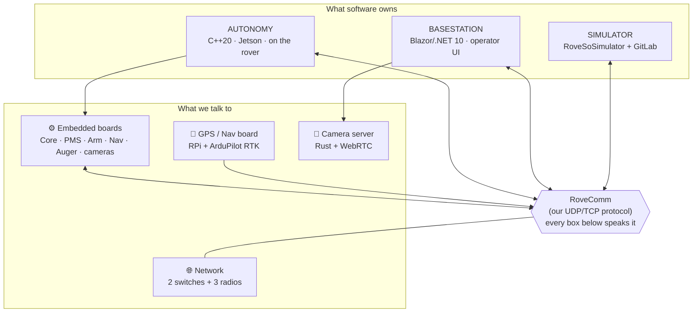

# The Big Picture

Everything we build serves one of URC's four missions. Each one is worth 100 points, and with the 100-point System Acceptance Review on top of that, there are 500 points on the table.

| Mission | What the rover does | Software it leans on |
|---|---|---|
| Science | Collect and analyze soil samples for signs of life, and cache one | Basestation (science UI, Raman/IR), cameras |
| Delivery | Find, pick up, and deliver objects across rough terrain, and a drone may help | Basestation (arm, driving), cameras, GPS |
| Equipment Servicing | Dexterous arm operations on a mock lander, plus an autonomous-typing sub-task | Basestation (arm), a bit of Autonomy |
| Autonomous Navigation | Drive itself to GPS points, AR-tag posts, and ground objects | Autonomy (the whole stack) |

:::note[Competition facts worth knowing]
URC 2026 runs May 27 through 30, 2026 at the Mars Desert Research Station near Hanksville, Utah. The part that matters the most for software is that the operators can't see the course from the C2 station, so they run the whole mission off of the [Basestation](../subteams/basestation) UI and the camera feeds. The rules also strongly encourage differential GNSS, which is the main reason we built the new [Differential GPS board](../foundations/gps). You get 15 minutes to set up and 10 minutes to tear down.
:::

## Languages by subteam

| Subteam | Language | Runs on | RoveComm lib |
|---|---|---|---|
| Autonomy | C++20 (GCC-10) | NVIDIA Jetson, on the rover | `RoveComm_CPP` |
| Basestation | C# / Blazor on .NET 10 | a browser at the base | `RoveComm_CSharp` |
| Simulator | Unreal Engine 5 | a dev laptop | `RoveComm_CPP` |
| GPS / Nav | Python | a Raspberry Pi on the rover | `RoveComm_Python` |

Once you understand [RoveComm](../foundations/rovecomm) and the [network](../foundations/network), you understand how all of this talks to each other, so start there.

:::note[Why C++ for Autonomy and C# for Basestation?]
We use C++ for autonomy because it's a relatively low-level language that gives us a lot of control, and it makes it easy to write fast code, which matters a lot for the real-time vision and control loops. See [`AutonomyThread`](../subteams/autonomy) for how we keep that fast code approachable to newer members.

We use C# for Basestation because Basestation is a web app built on Microsoft's Blazor Server framework, which is .NET, with C# and Razor pages. We went with Blazor because it's quick to develop in. We used React in years past, which meant writing a lot of HTML and JavaScript, and with Blazor we get to write the page and service logic in C#, embed C# right in the HTML, and mostly stay away from JavaScript unless we're building a custom component.
:::
