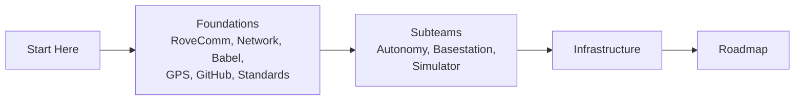

# The MRDT Software Bible

This is for the incoming Software Architect of the Missouri S&T Mars Rover Design Team.

You've just taken over three software subteams (Autonomy, Basestation, and the Simulator) along with all of the shared infrastructure that turns a pile of boards into a rover. The goal of this site is to give you the context you won't get from just reading the code, so it covers not only how things work, but why they're built the way they are, what we already tried that didn't work, and what's left to do.

It's worth saying a bit about why we do things our own way. We've won the University Rover Challenge two years running, and a big reason for that is that we build our own stuff instead of importing finished modules like a lot of teams do. The protocol ([RoveComm](../foundations/rovecomm#why-rovecomm-exists)), the autonomy stack, the networking, and the simulator are all ours. Building it ourselves is how we actually train good engineers, and it's how we keep control over the whole system. Keep that in mind as you read, because your job isn't only to keep it all running, it's to understand why it's ours and then make it better.

## How to read this

Read the [Architect's Role](./the-role.mdx) page next, and then work through the Foundations section. RoveComm and the network sit underneath everything else, so once those two click the subteams make a lot more sense. After that, jump to whatever subteam you're working on, and re-read the [Roadmap](../roadmap/roadmap.mdx) at the start of every competition cycle, since that's the running list of what still needs doing.

## A couple of conventions

You'll see two kinds of callout boxes throughout the site.

:::tip[ACTION]
Something you personally need to do, verify, or fill in. Usually a credential, a physical-access thing, or a detail that changes year to year and can't live in a repo.
:::

:::warning[WATCH OUT]
A known gotcha, a non-obvious constraint, or something that has burned us before. Read these even if you're in a hurry.
:::

One rule above all: if a repo and this site ever disagree, trust the repo. Repos change faster than docs do.

## The whole rover in a paragraph

We compete in the University Rover Challenge. The rover is a collection of embedded boards (Core, PMS, Arm, Nav, Auger, cameras, and so on) that all talk to each other using our own protocol, [RoveComm](../foundations/rovecomm), over a [network](../foundations/network) of two Cisco switches bridged by a set of wireless radios. The [Autonomy](../subteams/autonomy) computer is an NVIDIA Jetson, and it drives the rover by itself. The [Basestation](../subteams/basestation) is the operator's cockpit, and it runs in a browser. The [Simulator](../subteams/simulator) lets us test autonomy without a physical rover, and the new [Differential GPS board](../foundations/gps) gives us accurate position and heading. That's the whole thing in five links.
