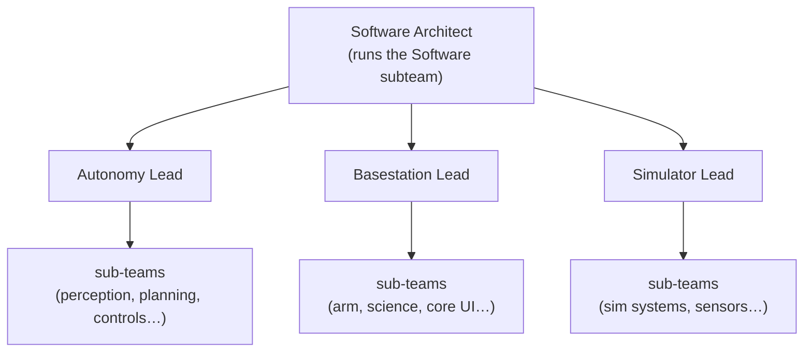
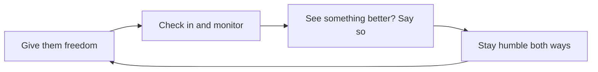

# The Software Architect's Role

The repos teach you the systems. This page is about the job itself, so read it before you start changing things.

## How the team is structured

The Software Architect runs the Software subteam as a whole. Under you are three division leads, one each for Autonomy, Basestation, and the Simulator, and inside those divisions are smaller groups focused on specific areas.

Your day to day is leading those three leads rather than writing every line yourself, and most of your leverage comes from the architecture decisions you make, the standards you hold, and the people you grow.

It wasn't always three. For a long time it was just Autonomy and Basestation, since those were our two main software stacks and one lead each made sense. Then when the simulator got its full remake, that project grew too large for the Autonomy lead to also manage on the side, so we created a dedicated Simulator lead position in 2024. If a future project grows the same way, don't be afraid to split off another lead.

## You are the final gate

You oversee all three divisions, and you're the final say on what makes it into the codebases and how new projects get architected, and that comes with some real responsibilities.

You have the power to say no, and you should use it. Don't accept code that's poorly written, unoptimized, or untested, because telling someone to go and do it properly is part of the job rather than an overstep. When you're deciding how to build something new, it's on you to come up with the best solution you can actually think of rather than the first thing that happens to work. And don't be afraid to throw away old code if there's something better and faster to replace it with, because the fact that we already wrote it is not a reason to keep it slow.

## Performance is the standard that matters most

Now that all three of our stacks have been rewritten, the biggest problem we'll run into over time is performance slowly slipping away. It happens quietly, a little bit of unoptimized code at a time, and one day the rover feels sluggish and nobody can point to a single cause. Always be watching for it, and keep the standard high so it doesn't erode.

This is a concrete thing and not just a slogan. The single most important thing autonomy does is avoid obstacles, and it has to be fast. The thing that costs us the most points every year is running into something or getting the rover stuck or beached on a rock, which you can read more about under [Autonomy](../subteams/autonomy#path-planning-global-vs-missing-local) and on the [Roadmap](../roadmap/roadmap.mdx). Fast, reliable obstacle avoidance is worth more than almost anything else you could build, so protect the performance budget that makes it possible.

## How to lead your leads

You'll have leads running the divisions under you, and the balance that works looks like this.

Give your leads a real chance to prove themselves, and give them freedom and ownership over their division, but keep checking in and stay aware of how they're actually doing, because freedom isn't the same thing as walking away. If you see something that could be done better, speak up and suggest it, and a good lead will have the humility to take that as a chance to learn rather than a threat.

The same goes for you. If one of your leads proposes something that's genuinely better than your idea, talk it through with them and learn their system as well as you can before you weigh in. You're meant to be a gate, but you're not meant to be a wall.

We win because we build our own work and we build engineers in the process, and that only holds up if the person at the top keeps the bar high, on code quality, on performance, and on the kind of humble, careful engineering that got us here. That's your job now.
