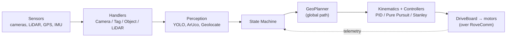
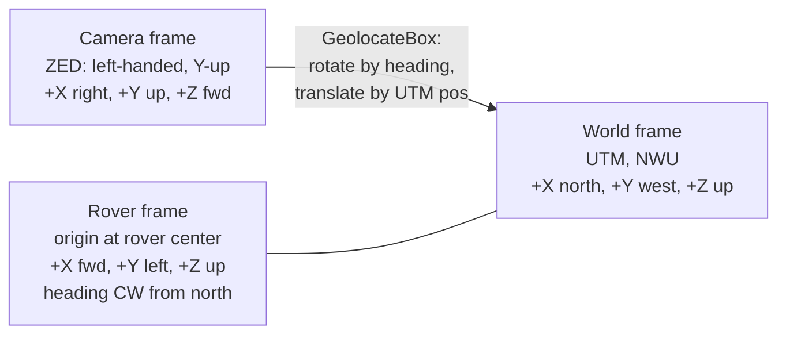
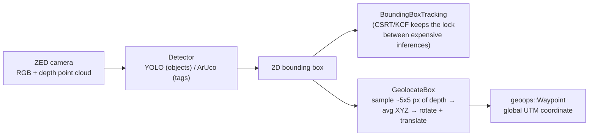

import StateMachine from '@site/src/components/visuals/StateMachine';

# Autonomy

`Autonomy_Software` is our C++20 codebase, and it runs on the rover's NVIDIA Jetson on JetPack 6. It's the most complex thing we maintain, and it's what wins or loses the Autonomy mission.

:::tip[The score to beat]
We scored 86/100 on the Autonomy mission at URC 2025, which is our best result yet. Two things cost us the rest of the points. We kept getting stuck on rocks, because right now we only have a global planner and no reactive local avoidance, and our custom YOLO model missed the water bottle on the object leg. Both of those are near the top of the [Roadmap](../roadmap/roadmap.mdx).
:::

## What the mission actually requires

From the [URC 2026 rules](../reference/links) (§1.f), the rover gets 30 minutes and a course of no more than 2 km to autonomously hit seven targets, in any order.

| Target | Count | Success criterion | GNSS accuracy given |
|---|---|---|---|
| GNSS-only location | 2 | stop within 3 m | exact coordinate |
| AR-tag post, ArUco `4x4_50`, 3-sided | 2 | stop within 2 m | coordinate 5–20 m from post |
| Ground object, orange mallet, rock pick, water bottle | 3 | autonomously highlight it on the C2 display, stopped | within 3 m for two, within 10 m for the bottle |

There are two facts buried in the rules that explain exactly why we lost points in 2025. The first is that the last two objects sit in obstacle fields, since the rules say "such as being in a boulder field," so URC is deliberately putting rocks between you and the target, and with only a global planner and no reactive avoidance we got stuck (see [Roadmap #1](../roadmap/roadmap.mdx)). The second is that the water bottle is the hardest target by design, because its color and markings are unspecified and explicitly not the same bottle used in 2024 or 2025, and it only comes with about 10 m of GNSS accuracy instead of the 3 m the others get. That means you can't just drive to a coordinate, you have to visually detect a bottle you've never seen before, and our YOLO model missing it cost us that object (see [Roadmap #2](../roadmap/roadmap.mdx)).

The rover also has to show an LED state indicator that's visible in daylight (§1.f.vi), where red means autonomous, blue means teleop, and flashing green means it reached a target. Autonomy drives that over RoveComm through the Core board's `StateDisplay` and LED packets.

## The state machine

The state machine decides what the rover does at any given moment. It's a hierarchical FSM that runs on its own thread inside `StateMachineHandler`, capped at roughly 60 iterations per second through `STATEMACHINE_MAX_IPS` so that it leaves CPU for the perception threads. The whole point of breaking the behavior into small, specific states is to keep the rover from doing two conflicting things at once, like trying to dodge an obstacle and line up on a tag at the same time.

Click through the states below to see what each one does and how it connects.

<StateMachine />

The states live in `src/states/` and the enum is in `src/interfaces/State.hpp`. Transitions are driven by discrete events like `eMarkerSeen`, `eReachedGpsCoordinate`, and `eStuckDetected`, and the thresholds behind those events live in `AutonomyConstants`. For example, `eNavigating` fires `eReachedGpsCoordinate` once it's within `NAVIGATING_REACHED_GOAL_RADIUS`.

### Failsafes and fallbacks

There are a few safety behaviors sitting on top of the normal flow. The state machine watches the cell voltage and forces a transition to Idle if it drops below `BATTERY_MINIMUM_CELL_VOLTAGE`, which is around 3.2 V, to protect the hardware. If it loses the tag or object while approaching, it falls back to a Search Pattern centered on the last known position instead of just driving forward blind. If the ZED's visual odometry and the absolute GPS position disagree by more than `STATEMACHINE_ZED_REALIGN_THRESHOLD`, which is about 0.5 m, it forces a realignment so the rover doesn't drive into imaginary obstacles or away from the goal. And the Stuck state above handles stuck recovery, with the recovery routine configured by `AttemptType`.

## Architecture

```
src/
├── AutonomyConstants.{h,cpp}   # EVERY tunable: PID gains, thresholds, model paths, ports
├── states/        # the mission state machine (above)
├── handlers/      # long-lived worker threads (each is an AutonomyThread)
├── drivers/       # RoveComm interfaces to boards: DriveBoard, NavigationBoard, MultimediaBoard
├── algorithms/
│   ├── planners/      # AStar (local) + GeoPlanner (global, USGS LiDAR)
│   ├── controllers/   # PIDController, PurePursuit, PredictiveStanley
│   └── kinematics/    # DifferentialDrive, UnicycleModel
├── vision/        # ZEDCam / BasicCam · objects/ (YOLO) · aruco/ (tags)
└── util/          # GeospatialOperations (UTM), Geolocate, YOLOModel.hpp …
```

:::note[First place to look for behavior]
Start in `AutonomyConstants.h/.cpp`. Almost every number that affects how the rover behaves is a named constant in there, including motor power, stuck thresholds, PID gains, model paths, confidence thresholds, and RoveComm ports.
:::

:::note[The class to understand first: `AutonomyThread`]
`AutonomyThread` is one of the most important classes in the whole codebase. It gets inherited by the cameras, the tag detectors, the object detectors, and several of the handlers, including the `StateMachineHandler`. It abstracts away a lot of the lower-level OS threading library so that contributors never have to touch raw threads, and the only thing they have to get right is proper resource protection with mutexes and semaphores. That's a big part of how Autonomy stays both fast and approachable to newer members. For parallel work like copying several camera frames at once, components reach for a `BS::thread_pool` instead of spinning up their own threads.
:::

## How data flows through it

The whole system is a loop with the state machine in the middle. The sensors feed the handlers, the handlers feed perception, perception feeds the state machine, the state machine picks a goal, the planner finds a path, and the kinematics turn that path into motor commands.



Anything that can block, like grabbing a camera frame or running a neural-net inference, runs on its own `AutonomyThread` at its own tick rate, so a slow inference never stalls the state machine loop.

## Coordinate frames

Most of the navigation and perception bugs come down to a frame mismatch, so it's worth knowing the three frames we use.



The world or global frame is where everything important lives, including the waypoints, the rover position, and the obstacle maps, and it's all in UTM, which is a flat Cartesian grid in meters. We convert GPS lat/lon to UTM as soon as it arrives so that the math stays Euclidean, and the convention is NWU, so +X is north, +Y is west, and +Z is up. The rover or kinematics frame has its origin at the center of the rover with +X forward, +Y left, and +Z up, and the heading is measured clockwise from north. The camera or perception frame is what the ZED SDK and OpenCV hand us, which is left-handed and Y-up with +Z pointing out of the lens. `GeolocateBox` takes a detection's (X, Y, Z) in that camera frame and converts it to a global UTM coordinate by rotating it with the rover's heading and translating it by the rover's UTM position.

## Path planning: global vs. (missing) local

This is the key thing to understand about why we hit rocks. `GeoPlanner` is our global planner, and it works. It builds a 2.5D costmap and runs a kinematically-constrained Weighted A\* over USGS LiDAR terrain to route around the large, permanent features like cliffs and big boulders before we ever drive. It reads a DuckDB database of USGS LAS 1.4 point clouds through `LiDARHandler`, where each cell has a slope, roughness, and curvature that turn into a traversability score, and the LiDAR pipeline in `data/LiDAR/build_lidar_databases.py` turns the raw USGS `.laz` files into those databases per site like MDRS, Hanksville, Tucumcari, and SDELC. The local `AStar` planner exists too, but we don't yet have a true reactive planner that consumes live ZED depth or LiDAR to dodge rocks that aren't in the USGS map, and that gap is exactly why we got stuck.

### Why USGS LiDAR? (the origin story)

This approach came out of years of pain. Obstacle avoidance is one of our hardest problems, and historically either the algorithm wasn't good enough or the hardware couldn't process the data fast enough, and it's intimidating enough that a lot of members won't even take it on, and the ones who do rarely end up landing working code in the codebase. So instead of fighting reactive avoidance for the umpteenth time, the team went after the global half of the problem first. The USGS LiDAR Explorer makes publicly-available aerial LiDAR scans of the entire US easy to download, so we wrote a script to parse that data into a database, and then we wrote a custom hierarchical A\* that plans global paths over it.

The goal was to have a relatively smart global planner that any user anywhere in the codebase can reach out to and get back a clean, easy-to-use path that's least likely to run into any large static obstacle. It deliberately handles the big permanent stuff, so that the local planner we still need to build only has to deal with the dynamic rocks right in front of the wheels.

## Vision & YOLO

Perception turns the camera and depth data into "there's a tag or object at this exact GPS coordinate," which is what the state machine actually acts on.



For cameras, the Stereolabs ZED stereo gives us RGB plus a depth point cloud and spatial mapping through `ZEDCam`, and there's a plain `BasicCam` as well, and in sim the frames come over WebRTC. For object detection, `ObjectDetector` runs a custom-trained YOLO model exported to TorchScript as `best.torchscript`, and the models live in `data/models/yolo_models/`, with `bmp_v4` and `bmp_v6` for objects and `tag/` for ArUco. Between inferences, `BoundingBoxTracking` uses CSRT or KCF trackers to keep the lock on a target so we don't have to pay for a full inference on every frame. For tags, `aruco/TagDetector` uses OpenCV's ArUco for fast detection, with a Torch tag model layered on to catch tags that are partially occluded or too far away for ArUco's corner refinement, and `TagDetectionUtility` estimates the tag's 6D pose, meaning its distance and yaw. For geolocation, `GeolocateBox` in `util/vision/Geolocate.hpp` takes a detection's pixel, pulls the matching depth out of the ZED point cloud, averages a small neighborhood, and converts that camera-frame vector into a global UTM coordinate using the rover's heading and position. For training and augmentation, `YOLO/custom_augment.py` applies grayscale, HSV shift, and copy-paste augmentation with an 80/10/10 split at 640×640, and that's the starting point for the model work on the roadmap.

:::note[Known perception limits worth respecting]
ArUco detection leans heavily on contrast, so direct sun glare or a harsh shadow on a printed tag can defeat the corner refinement. Fast turns blur the feed and drop frames in both YOLO and ArUco, which is why `MAX_TURN_SPEED` is capped in the drive kinematics. And the ZED's depth accuracy falls off past roughly 15 to 20 m, so geolocated coordinates for distant targets carry more error, and you want to get closer before you trust the fix.
:::

### Why train our own model?

We train our own models because the objects we have to detect are very specific. They're things like ArUco tags, an orange mallet, a rock pick, and a plastic water bottle of any color, and standard pretrained models aren't very good at detecting hyper-specific things like that. The ones that are tend to be large, heavy models that aren't lightweight enough to run fast on the Jetson, so a lightweight custom-trained YOLO is our best bet even though it means we have to put in the extra effort to build the dataset.

The data pipeline is straightforward. We gather images of each object, from the real world and from the simulator, upload them to [Roboflow](https://roboflow.com) and annotate everything, train the YOLO model, and then drop it into Autonomy where a custom inference class runs it.

### The three controllers, when each is used

We ship three path-following controllers because different parts of the codebase need different behavior.

| Controller | Used in | Why this one |
|---|---|---|
| PID | many places, like steering | simple and well-understood, good for direct single-variable control |
| Pure Pursuit | search pattern | a simple, robust path-follower for the spiral search |
| Predictive Stanley | navigation state | tracks the path much more tightly, but only works well for longer, straight or gently curvy routes, and not for paths that cross themselves or loop |

## How Autonomy talks to everyone

The Autonomy board is at `192.168.3.100`. The key commands coming in from Basestation are `StartAutonomy` (11000), `AddPositionLeg` (11002), `AddMarkerLeg` (11003), `AddObjectLeg` (11004), `SetMaxSpeed` (11006), `SetMinTravScore` (11007), `SetBetaBias` (11008), and `AddObstacle` (11010). The telemetry going back out is `CurrentState` (11100), `CurrentLog` (11102), and `ThreadFPS` (11103).

## Build & run

It's all CMake inside the dev container. `BUILD_SIM_MODE=ON` builds `Autonomy_Software_Sim`, which talks to the [Simulator](./simulator) on the sim ports, and `BUILD_TESTS_MODE=ON` builds the tests for `ctest`, along with the coverage, verbose, and install modes. Keep `cmake.parallelJobs` at or below half your cores. It only builds with GCC-10, and the container handles that for you.
