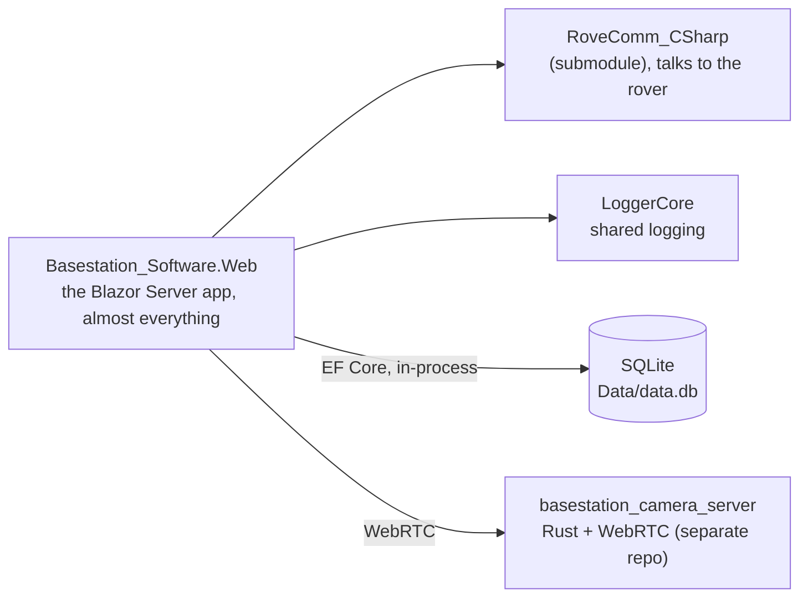

# Basestation

`Basestation_Software_Blazor` is the operator's cockpit. It's a Blazor Server app on .NET 10 that runs in a browser at the base station, and everything the operators see and every command they send to the rover goes through it. That matters a lot at competition, because the operators can't see the course directly, so they run the whole mission off of this UI and the camera feeds.

:::warning[The repo README is out of date]
The README still describes an older three-project layout with a separate `Basestation_Software.Api` REST project and a `Basestation_Software.Models` class library, and both of those are gone now. The current solution is a single Blazor app plus the two supporting libraries below, so trust the `.sln` over the README.
:::

## Shape of the solution

The solution is three projects.



`Basestation_Software.Web` is the Blazor Server app, and it's where almost all of the work happens. The UI lives in `Core/Components/<subteam>/*.razor`, the data models live in `Models/`, and the logic lives in `Core/Services/*`. `RoveComm_CSharp` is a submodule (`RoveComm.csproj`) and it's how the app talks to the rover, and `LoggerCore` in `LoggerService/` is a small shared logging library. The video comes from `basestation_camera_server`, which is a separate Rust process, over WebRTC. Because it's Blazor Server, the app runs on the server side and can do things a normal browser app can't, like hitting the database directly, so there's no separate REST API tier anymore.

## The services

The app is built around a set of services that are registered in `Program.cs` and injected into the components, including `DatabaseService`, `OpService`, `PingService`, `GPSWaypointState`, `CameraService`, `Rover3DService`, `VRService`, `CookieService`, and `SwitchMonitorService`, among others. The components are grouped by subteam, with Autonomy (AutoControls, AutoMonitor, AutoStateDiagram, AutoVisualizer, Waypoints, AutoDetection), Arm, Science (the Raman graph, environmental), and Core (Drive, Gimbals, PMS, GPS, Map, CameraDisplay, RocketTelemetry, SwitchMonitor, ManualPacketSender).

## The database

The app talks to a local SQLite database at `Data/data.db` directly with EF Core, registered as a `DbContextFactory<DatabaseContext>` and created at startup with `EnsureCreated()`. The `DatabaseService` singleton wraps it and adds a change-notification system, so components can subscribe to table or entity changes and update live when the data changes. It persists more than you'd expect, including the GPS waypoints, the cached map tiles and LiDAR tiles for the map, the saved arm poses and control presets, and the page and layout config, which is why the map and the arm setups survive a restart.

## How to run it

```bash
git submodule update --init --recursive
# The Rust camera server has to be running for video:
#   github.com/MissouriMRDT/basestation_camera_server/releases/latest
dotnet run --project Basestation_Software.Web --urls http://localhost:8080
```

:::tip[Competition layout]
The Basestation PC runs Firefox with four full-screen portrait 1080×1920 windows, so design and test the components to lay out at that aspect ratio. You can serve to other devices on the network with `--urls 'http://*:8080'`.
:::

## Notable libraries

We use Bootstrap for icons, Leaflet for the interactive map, three.js for the 3D rover model, and Chart.js for the Raman spectrometer graph.

:::note[Why Blazor?]
Blazor Server is .NET, so we get to write almost everything in C#, including the page logic, the services, and even C# embedded directly in the HTML and Razor. We used a React stack in years past, which meant writing a lot of HTML and JavaScript, and Blazor is just a lot faster to develop in, so the only time we really drop down to JavaScript anymore is for a custom component. There's a slightly longer version of this reasoning on the [Big Picture](../start/big-picture) page.
:::

:::note[Why a separate Rust camera server?]
The camera streams arrive as UDP multicast and have to be re-served to the browser over WebRTC, and that's the kind of low-level, high-throughput networking that Rust is good at and that would be awkward to do inside the Blazor app, so it lives in its own `basestation_camera_server` process.
:::
