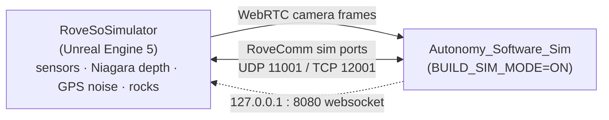

# Simulator

`RoveSoSimulator` lets us develop and test Autonomy without a physical rover. Its authoritative copy lives on a self-hosted GitLab on the [CCF PC](../infra/infrastructure#ccf-pc-simulator--gitlab), and GitHub is just a mirror. The reason it's self-hosted instead of living on the MissouriMRDT GitHub org is that an Unreal project is huge, and we ran out of Git LFS quota on the org's GitHub account, so we moved it onto self-hosted GitLab where the storage isn't capped.

## Built in Unreal Engine 5

The simulator is built in Unreal Engine 5, and it's genuinely good at testing autonomy features rather than being a toy. It has a full ZED stereo-camera system built into it, and it can simulate all of our other sensors too, including every camera, the GPS, and the compass. It even uses Unreal's Niagara particle system to simulate depth from the ZED camera and return a real point cloud to us, which is the same kind of data the real ZED gives us, and it can simulate GPS noise and a variety of rocky environments, so you can rehearse the exact obstacle and terrain conditions that cost us points at competition.

The simulator speaks RoveComm too, using the `RoveComm_CPP` library, so it talks the exact same protocol as the real rover and the rest of the stack can't tell the difference between sim and hardware. Autonomy connects to it through its simulation build mode, where `BUILD_SIM_MODE=ON` builds `Autonomy_Software_Sim`, and it talks RoveComm on the sim ports (UDP 11001 and TCP 12001) with `SIM_IP_ADDRESS = 127.0.0.1` and `SIM_WEBSOCKET_PORT = 8080`, and the camera frames come over WebRTC through `vision/cameras/sim/`. The manifest reserves a `RoveSoSimulator` node at `127.0.0.1`. Because it returns a real point cloud and simulates rocks and GPS noise, it's the right place to develop the fast local obstacle avoidance that the [Roadmap](../roadmap/roadmap.mdx) calls for, before you risk the physical rover on it. The mission recordings from this year live in the project root as `*.mp4` files (Science Sim, Delivery Mission, Equipment Servicing) and are useful reference footage.

:::tip[ACTION, claim this early]
Early in your term, get on the CCF PC, clone the simulator GitLab, document how to build and run it here, and reconcile it with the GitHub `RoveSoSimulator` repo so that there's one source of truth.
:::
